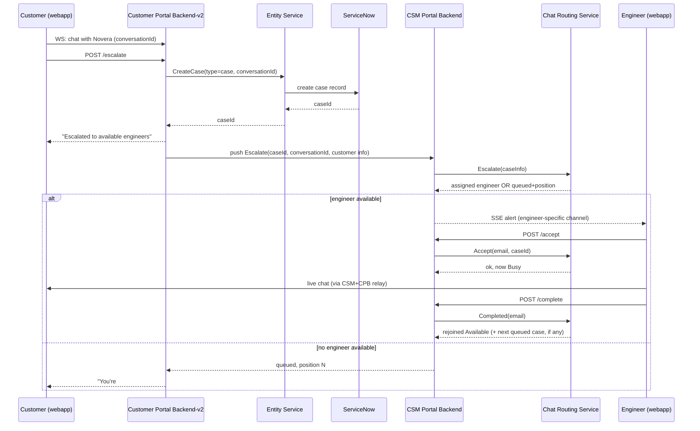
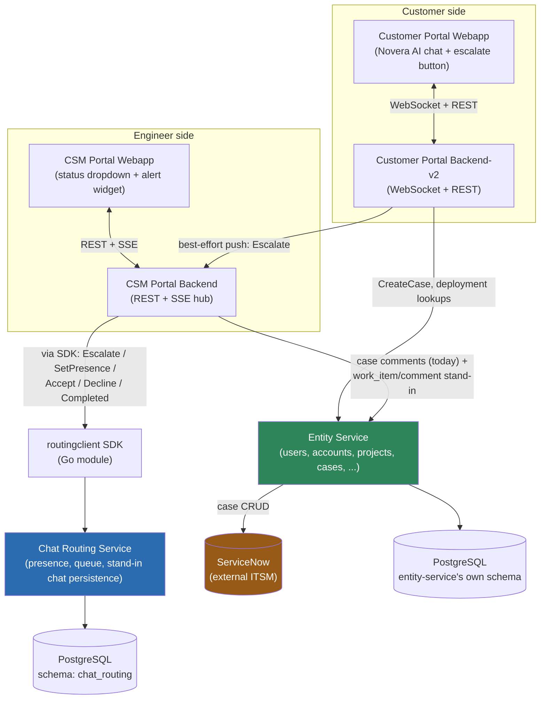
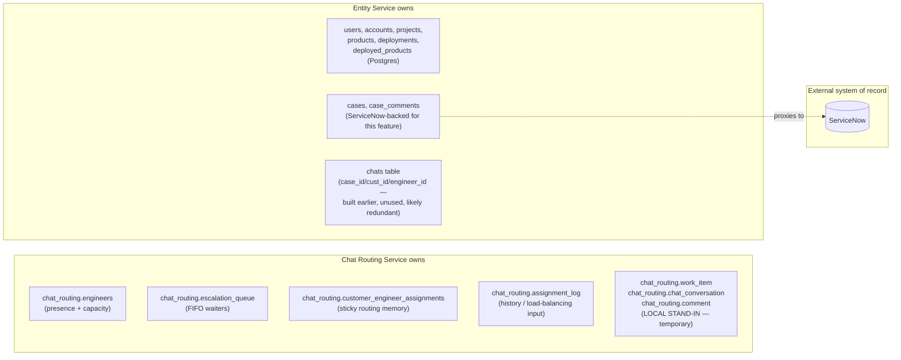
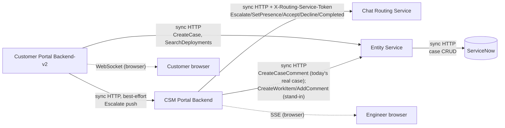
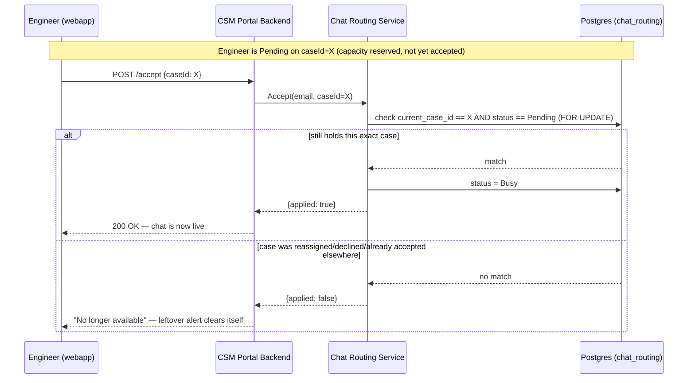
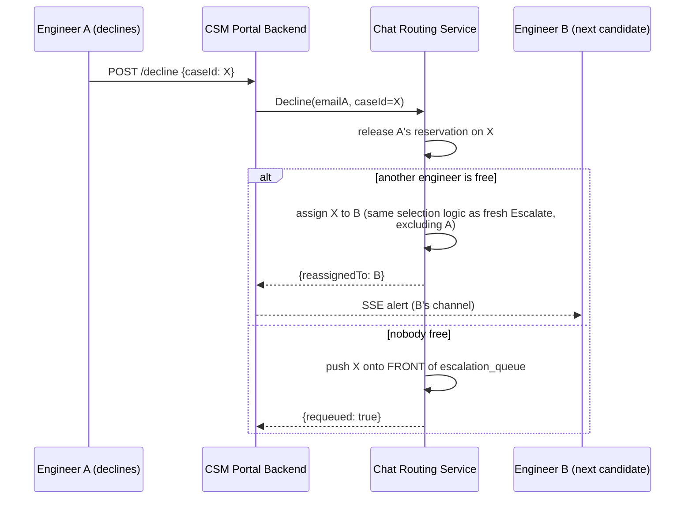
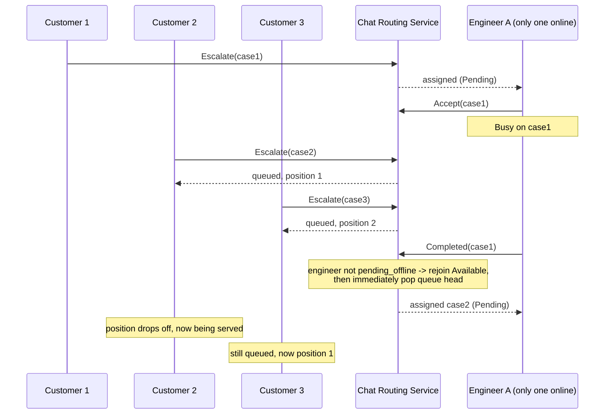
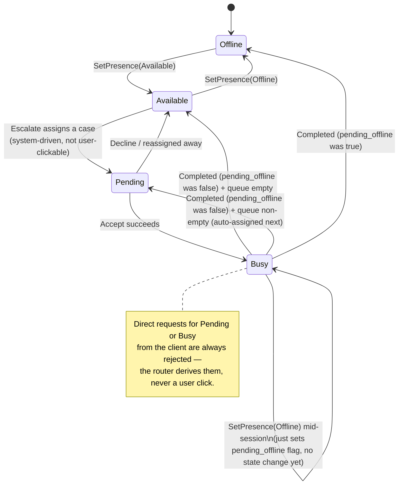

# Live-Engineer-Chat Escalation — Full Project Explainer

*Prepared for presenting to a senior engineer/mentor. Built from the project's own working docs (`live-engineer-chat-escalation-summary.md`, `chat-persistence-mapping-plan.md`) and direct inspection of the `cs-tools` monorepo — not from the Google Doc, which wasn't accessible. Where something is inferred rather than explicitly documented, it's labeled **(inferred)**. Where something is a genuine gap in the docs, it's labeled **(not documented — ask before presenting this as fact)**.*

---

## 1. What the project is

### The problem

WSO2's customer support already has an AI chat assistant ("Novera") that customers can talk to inside the Customer Portal. Novera is good at answering routine questions, but sometimes a customer needs an actual human — and until this project, there was no bridge between "talking to a bot" and "talking to a support engineer" inside that same chat window. The customer's only option was to leave the chat and file a support case the old-fashioned way.

### Who the users are

- **Customers** — WSO2 clients using the Customer Portal's AI chat, who click one button to ask for a live person instead of leaving the conversation.
- **Support/CSM engineers** — the people staffing the CSM Portal, who get pulled into a live chat with a specific customer when one is routed to them.
- Indirectly, **whoever owns the case afterward** — the escalation still produces a normal support case in the existing system of record, so it's visible and workable the same way any other case is.

### The main purpose of the system

Give a customer, mid-AI-chat, a reliable way to reach exactly one available human engineer in real time — with fairness (don't dogpile one engineer while others sit idle), continuity (a returning customer reconnects with the same engineer when possible), and graceful degradation (if everyone's busy, wait in a line instead of being dropped).

### What happens, start to finish (plain language)

1. A customer is chatting with Novera (the AI) about a problem.
2. They click a button to say "I want to talk to a real person."
3. The system creates a real support case behind the scenes (so there's a paper trail, just like any other case) and asks a separate "routing" component: *who's free right now?*
4. If someone's free, that one engineer — and only that engineer — gets a pop-up alert. If nobody's free, the customer is told they're in a queue.
5. The engineer sees the alert, clicks Accept, and a live two-way chat opens between them and the customer.
6. When they're done, the engineer clicks End Session. If anyone was waiting in the queue, they're immediately handed to that engineer next (assuming the engineer didn't mark themselves as going Offline first).

That whole loop is what "escalation" means in this project everywhere below.

---

## 2. Complete end-to-end flow

### Realistic walkthrough, step by step

**Customer starts an AI chat.** The customer opens the Novera chat page in the Customer Portal webapp. This is a WebSocket connection to `customer-portal/backend-v2`, identified by a `conversationId` (a UUID) that represents *this specific chat thread* — separate from any support case ID, because at this point no case exists yet and the customer might never escalate at all.

**Customer requests escalation.** The customer clicks the escalate control (a circular icon button under Novera's replies, gated so it only shows when escalation makes sense — e.g., not before the project/deployment context is known). This calls `POST /projects/{id}/support/chat/{conversationId}/escalate` on `backend-v2`.

**Case creation.** `backend-v2` looks up the customer's project's deployment and deployed product (needed because a real case requires them), then calls `entity-service`'s `CreateCase` with `Type: "case"`, subject/description/severity defaults, and the `conversationId` attached. `entity-service` creates this as a real case — for the ServiceNow-backed case type, that means a real ServiceNow ticket exists now, not just a local database row. **This is the business record**: it's what shows up in normal case lists, reporting, SLAs, etc., independent of whether the live-chat routing succeeds.

**Routing.** `backend-v2` then does a best-effort internal push to `csm-portal/backend` (`h.csm.Escalate`) carrying `caseId`, `conversationId`, project/customer info, and the opening message. `csm-portal/backend` calls into `chat-routing-service` (via the `routingclient` SDK) to ask: is there a free engineer? The routing service's logic (see §6) either assigns one specific engineer or queues the case.

**Engineer notification.** If an engineer was assigned, `csm-portal/backend` publishes an alert over Server-Sent Events (SSE) addressed to *that one engineer's* connection key — not broadcast to everyone. Their browser (`EngineerAlertNotification` component) pops up the case details.

**Engineer accepts.** The engineer clicks Accept. This is a database-backed check in `chat-routing-service` (not just a UI state change) confirming they're still the one holding that case, then flips their status from **Pending** to **Busy**. Only now does the live chat widget become fully "active."

**Live customer ↔ engineer chat.** Messages flow both directions: engineer messages go through the routing-service's stand-in persistence (`comment` rows) via `csm-portal/backend`; customer messages are relayed through `backend-v2` over the same WebSocket, to the same conversation, with `csm-portal/backend` writing the persisted copy.

**Engineer declines.** If the engineer dismisses instead of accepting, `chat-routing-service` is told to release that engineer's reservation on the case and either (a) hand it straight to another free engineer, or (b) push it back onto the **front** of the queue (the customer already waited once — they shouldn't lose their place).

**Re-routing.** This is the same assignment logic as a fresh escalation, just re-entered from the decline path instead of the initial-escalate path, and explicitly excluding the engineer who just declined.

**Multiple customers entering the queue.** If every engineer is Pending/Busy when a new escalation arrives, the case is appended to the FIFO `escalation_queue` instead of assigned. The customer's chat gets a "you're #N in line" message. No engineer sees an alert for this case yet.

**Engineer completes the session.** Clicking End Session calls `Completed`. If the engineer had flagged themselves for Offline mid-chat, they go Offline and do **not** get handed anything from the queue. Otherwise they go back to Available and, if the queue is non-empty, are **immediately** assigned the head of the queue (they may go straight from Busy on customer A to Pending on customer B with no idle moment in between).

**Next queued customer assigned.** That customer's chat gets an alert-equivalent — the engineer sees a new Pending case the moment the previous one ends.

### Sequence diagram — the whole loop, happy path

---

## 3. Architecture

Below, for each component: what it does, why it exists, what it talks to, what data it owns, and what it deliberately stays out of.

### Customer Portal (webapp)

- **What it does:** the customer-facing UI — the Novera AI chat page, the escalate button, the live-chat message view once a human joins.
- **Why it exists:** it's the customer's only touchpoint; everything else in this system is invisible to them.
- **Talks to:** `customer-portal/backend-v2` over WebSocket (chat) and REST (escalate, deployments lookups).
- **Owns:** no persistent data — it's a client. Holds only in-memory/browser state (current conversation, message list).
- **Should NOT be responsible for:** deciding who gets the case, knowing engineer identities, or holding any routing/security tokens.

### Customer Portal Backend (`backend-v2`)

- **What it does:** terminates the customer's WebSocket connection, relays AI/human messages, validates and kicks off escalation (deployment lookup → `CreateCase` → best-effort push to CSM Portal Backend).
- **Why it exists:** it's the trusted intermediary between the customer's browser and every internal service — the browser never talks to `entity-service` or `chat-routing-service` directly.
- **Talks to:** `entity-service` (cases, deployments, deployed products), `csm-portal/backend` (the internal escalate/notify push, best-effort).
- **Owns:** the live WebSocket connection registry (in-memory, per `conversationId`) — no durable data of its own for this feature.
- **Should NOT be responsible for:** routing decisions, engineer presence, or persisting chat messages (that's `csm-portal/backend`'s job via the routing-service stand-in tables) — this only relays.

### CSM Portal (webapp)

- **What it does:** the engineer-facing UI — status dropdown (Available/Pending/Busy/Offline), the floating alert widget for an incoming/active case, the live chat view.
- **Why it exists:** engineers' side of the same live-chat feature, plus their status control.
- **Talks to:** `csm-portal/backend` over REST (status, accept, complete, decline) and SSE (real-time alerts).
- **Owns:** no persistent data; some client-side cache (React Query) of "my current status/case," which is exactly the thing that caused the stale-state bugs discussed in §9.
- **Should NOT be responsible for:** deciding the outcome of Accept/Decline itself — it calls the backend and trusts the database-backed result, not just its own local state.

### CSM Portal Backend

- **What it does:** the engineer-side API — proxies status changes and case actions to `chat-routing-service`, manages the SSE hub that pushes alerts to specific engineers, persists chat messages via the routing-service's stand-in tables, and receives the escalate push from `backend-v2`.
- **Why it exists:** same reasoning as `backend-v2` — it's the trusted backend behind the CSM webapp, holding the internal service-to-service token that talks to `chat-routing-service`, which the browser must never see.
- **Talks to:** `chat-routing-service` (via the SDK), `entity-service` (case comments — today's real case path — and the stand-in `work_item`/`comment` writes), the customer side via `backend-v2` for message relay.
- **Owns:** the SSE connection registry (in-memory, keyed by engineer email, with a broadcast key as a fallback — see §6).
- **Should NOT be responsible for:** presence/queue state itself — it delegates every state decision to `chat-routing-service` and just relays the result.

### Chat Routing Service

- **What it does:** the single decision-maker for "who gets this case." Owns engineer presence (Available/Pending/Busy/Offline), the FIFO queue, sticky-customer preference, least-busy fallback, and (as a stand-in) the live-chat's own message/work-item persistence.
- **Why it exists:** this is the core of the whole feature and the main architectural addition. See §6 for the full reasoning on why it's a separate service rather than logic bolted onto an existing one.
- **Talks to:** its own PostgreSQL schema (`chat_routing`) only. It does not call `entity-service`, ServiceNow, or any other service — it's a pure decision engine reached over synchronous HTTP.
- **Owns:** `engineers`, `escalation_queue`, `customer_engineer_assignments`, `assignment_log`, plus the stand-in `work_item`/`chat_conversation`/`comment` tables (temporary — see §7).
- **Should NOT be responsible for:** case business data (subject, severity, ServiceNow sync), authentication of end users, or talking to any frontend directly — it's only ever called by other backends, never a browser.

### Entity Service

- **What it does:** owns the core CS-platform business entities — users, accounts, projects, products, deployments, deployed products, and **cases** (plus case comments) — behind one REST API, normalizing multiple underlying data sources (confirmed in the repo: it explicitly supports a "ServiceNow data source" for cases, with some case operations documented as ServiceNow-only, e.g. attachments/tags/feedback).
- **Why it exists:** it's the shared system-of-record other services (portal backends, this project included) build on rather than each owning a fragile direct integration with ServiceNow.
- **Talks to:** PostgreSQL (its own tables) and ServiceNow (via `internal/servicenow-integration-service` and the `sn_*_service.go` files) for case data specifically.
- **Owns:** the real, durable case record for this feature (subject, description, severity, project/deployment/product linkage) — this is the actual support ticket, and it's what the rest of the org sees.
- **Should NOT be responsible for:** live-chat presence, routing, or the transient message stream — none of that is "core CS-platform entity" data, which is exactly why this project didn't try to bolt it on here.

### Novera / AI chat agent

- **What it does:** answers the customer's questions in natural language before escalation. Not something this project modified — the AI chat existed first; this project only added the door out of it.
- **Talks to:** `customer-portal/backend-v2`'s WebSocket handler, same channel the human-relay messages later use.
- **Owns:** nothing persistent from this project's point of view.
- Beyond this, the AI chat agent's own internals are outside what this project touches or documents — **(not documented here)**.

### ServiceNow

- **What it does:** the external ITSM system of record for cases (and, more broadly, incidents, change requests, problems, service requests — this whole family is ServiceNow-backed in the broader `cs-tools` platform, confirmed by the extensive `sn_*_service.go` files in `entity-service`).
- **Why it exists:** it predates this project entirely — it's WSO2's existing support-ticketing backend, and this feature deliberately reuses it rather than inventing a parallel case system.
- **Talks to:** only `entity-service` (via `internal/servicenow-integration-service`) — no other service in this feature calls ServiceNow directly.
- **Owns:** the authoritative case record once escalation creates one.
- **Should NOT be responsible for:** anything about the live chat itself — presence, routing, message transcripts. ServiceNow only knows a case exists; it has no idea a live chat happened around it unless something later attaches that transcript to it (see the open question in §7 about whether that will ever happen).

### PostgreSQL

- **What it does:** the one physical database instance backing both `entity-service` and `chat-routing-service` — but as two independently-owned schemas (`chat_routing` for the routing service, entity-service's own default schema for its tables), each with its own migration-version table, specifically so they can never collide.
- **Why it exists:** standard durable storage; the explicit design choice here is schema-per-service on one instance, not one database per service and not one shared schema — see §6 for the reasoning.
- **Talks to:** whichever service owns each schema.
- **Owns:** literally everything durable in this system except the ServiceNow case record.

### Redis

**Not used anywhere in this project.** A repo-wide search found `redis` mentioned only in an unrelated app (`mttr-application`'s docs) — nothing in the live-engineer-chat-escalation feature, `chat-routing-service`, `csm-portal`, `customer-portal`, or `entity-service` references it. All of this feature's state (presence, queue, message stand-in) lives in Postgres; the only in-memory state is the SSE/WebSocket connection registries, which are deliberately per-process and not meant to survive a restart (see §7 and §9's limitations). If the original Google Doc implied Redis is part of this system, that doesn't match what's actually in the repository — worth flagging rather than repeating.

### WebSocket / SSE

- **What it does:** two different real-time transports for two different audiences. WebSocket connects each customer's browser to `backend-v2` for the AI chat and, later, relayed human messages. SSE connects each engineer's browser to `csm-portal/backend` for one-way push alerts (new case, effectively).
- **Why two different transports:** the customer side needs bidirectional messaging (they're chatting), so WebSocket is the natural fit. The engineer side's *notification* need is one-directional (server tells engineer "you have a case") — SSE is simpler for that and is what the alert mechanism was already built on before this project (see §6, "Why SSE for engineer notifications").
- **Talks to:** browser clients only; not used between backend services.
- **Owns:** no durable data — purely transport. The registries mapping "which connection belongs to which engineer/customer" are in-memory and process-local.
- **Should NOT be responsible for:** durability. If a connection drops, the underlying state (in Postgres) is still correct; the UI just needs to re-fetch it on reconnect — which is exactly the bug that had to be fixed for the floating widget (see §9).

### SDK / client libraries

Covered in full in §8. In short: `apps/chat-routing-service/sdk-go` is a small, versioned Go module wrapping `chat-routing-service`'s HTTP API, so any Go service — today only `csm-portal/backend` — can call it without hand-copying the HTTP client.

### High-level architecture diagram

### Data/database ownership diagram

### Service-to-service communication diagram

Every arrow between backend services here is **synchronous HTTP, request/response, no callbacks and no message queue** — a deliberate choice covered in §6.

---

## 4. Database/data model

### The tables

| Table | Schema owner | What it represents, in plain English |
|---|---|---|
| `engineers` | chat-routing-service | One row per engineer who has ever set a status. Holds their current status (Available/Pending/Busy/Offline), a `pending_offline` flag ("go offline once this chat ends"), which case they're on right now (ID + a JSON snapshot), and when they became available (used as the tie-breaker for least-busy routing). |
| `escalation_queue` | chat-routing-service | The waiting line for customers when nobody's free. Each row has a sortable position rather than just a timestamp, specifically so a declined case can be reinserted at the **front**, not appended to the back. |
| `customer_engineer_assignments` | chat-routing-service | "Who did this customer last talk to?" — one row per customer, used purely to make routing *prefer* reconnecting them to the same engineer (sticky routing), not a hard requirement. |
| `assignment_log` | chat-routing-service | An append-only history of every assignment ever made. Used to compute "how many chats has this engineer handled today" on the fly (a live count, not a maintained counter that could drift or need a midnight reset) — and doubles as an audit trail. |
| `work_item` | chat-routing-service (LOCAL STAND-IN) | A generic "here's a task" record — id, creator, subject, work-item number. Modeled after (but simpler than) a real cross-cutting `WORK_ITEM` supertype `entity-service` is expected to eventually own. |
| `chat_conversation` | chat-routing-service (LOCAL STAND-IN) | The live-chat-specific detail row attached to a `work_item` — carries `conversation_id`, `case_id`, and (once accepted) `engineer_id`. |
| `comment` | chat-routing-service (LOCAL STAND-IN) | One row per chat message, from either side, foreign-keyed to `work_item` (not to `chat_conversation`) — the plan is for this to be a shared comment mechanism across every future work-item type, not just chat. |
| Cases (ServiceNow-backed) | Entity Service → ServiceNow | The actual support ticket: subject, description, severity, issue type, project/deployment/product linkage, assignee. This is the durable business record that exists independent of whether the live chat routing succeeds at all. |

### Business/domain data vs. chat/message data vs. routing state vs. presence state

These four are easy to blur together, and the project's own docs are careful to keep them separate:

- **Business/domain data** — the ServiceNow-backed case. Exists because a support interaction happened; matters to reporting, SLAs, whoever picks it up later. Doesn't know or care that a live chat happened around it.
- **Chat/message data** — the `work_item`/`chat_conversation`/`comment` stand-in. This is the transcript and the "which engineer is on this specific conversation" link — think of it as the *content* of the interaction, separate from the *ticket* about it.
- **Routing state** — `escalation_queue`, `customer_engineer_assignments`, `assignment_log`. This is decision-support data: who's waiting, who talked to whom before, who's handled how much today. It's read to make an assignment decision and then mostly just accumulates as history.
- **Engineer presence state** — the live parts of `engineers`: current status, `pending_offline`, `current_case_id`. This is *right-now* capacity truth, checked and changed on nearly every request in this feature.

All four currently live in the same Postgres instance, but in a schema `chat-routing-service` owns exclusively (except the ServiceNow case, which is `entity-service`'s). That separation — not the physical database — is what actually matters here; see §6.

### `conversationId`

`conversationId` is the identifier of the customer's live chat **thread** — generated when the customer's WebSocket chat session with Novera starts, before any escalation happens **(inferred from where it first appears — as a client-supplied field validated as a UUID on the escalate call — rather than explicitly documented in the persistence-mapping doc)**. It's reused as: (a) the WebSocket push key on the customer side, (b) a field on the ServiceNow case, and (c) a real column on the stand-in `chat_conversation` table. Its purpose is to give every layer of this system — customer browser, `backend-v2`, `csm-portal/backend`, `chat-routing-service`'s stand-in tables — one shared handle for "this specific live conversation," deliberately decoupled from the case ID, since the case is business/ticket identity and the conversation is transport/session identity. The persistence-mapping doc records that where exactly `conversationId` should live long-term was never confirmed by the engineer (Sajith) who owns the upstream schema — it was a unilateral decision to put it on `chat_conversation`, flagged as something that might need a follow-up migration.

### Case vs. `work_item` vs. `chat_conversation`

- **Case** = the real, ServiceNow-backed ticket. One per escalation. This is what exists today, in production, and is what the rest of the organization sees.
- **`work_item`** = a generic stand-in for what `entity-service` is expected to eventually formalize as a cross-cutting supertype for "any kind of task" (case, incident, service request, chat, etc.) with one shared identifier and one shared comment table. It is **not real yet** — the schema owner (Sajith) hasn't merged it. This project built a local look-alike so the routing service's own persistence had somewhere to go, without waiting on that schema.
- **`chat_conversation`** = the row that would exist *underneath* a `work_item`, specifically for the chat use case — the same relationship a `case`-specific detail table would have.

Today, `case` and `work_item` are **two separate, unlinked records** that happen to reference each other only via the `case_id` field chat-routing-service unilaterally added to `chat_conversation`. There is no foreign key from Postgres to ServiceNow (there couldn't be — they're different systems), and no code currently reads both together to present a unified view.

---

## 5. Design decisions

### Why Chat Routing Service is separate from Entity Service

**Chosen:** a brand-new, independent service, not a module inside `entity-service`.

**Alternative:** add presence/queue logic as new endpoints and tables inside `entity-service`, since it already owns "cases."

**Why this way (as documented):** `entity-service` owns durable *business* entities behind a deliberately generic four-layer CRUD architecture (handler → service → repository → Postgres) — it's not built around fast-changing, highly stateful, single-purpose logic like "who is free right now." Routing decisions change on nearly every request in this feature and need a strict, hand-rolled state machine, not a generic entity CRUD pattern.

**Advantages:** a bug in a brand-new, experimental feature can't destabilize the entity service every other portal already depends on; the two can be deployed, scaled, and iterated on independently; `chat-routing-service`'s schema can be deleted wholesale later with zero risk to `entity-service`'s real data if this prototype doesn't pan out.

**Disadvantages:** an extra network hop and an extra service to run/monitor/keep alive; two Postgres schemas to reason about instead of one; the SDK/`replace`-directive plumbing this required.

**What would change with the alternative:** routing logic would live in the same process/deploy as core entities, removing a hop but coupling a stable, general system to fast-moving, feature-specific logic — exactly the coupling this decision avoided.

### Why separate schemas/services (not one shared schema)

**Chosen:** two services, two independently-owned Postgres schemas on the same physical instance, each with its own migration-version table.

**Alternative (tried and reverted the same day):** consolidate the stand-in `work_item`/`chat_conversation`/`comment` tables into `entity-service`'s own schema.

**Why reverted:** confirmed with the mentor that two services each owning their own schema is the normal, sound pattern here — not something to collapse. Concretely: these stand-in table names deliberately mirror what `entity-service`'s real future migration will be named, so sharing a schema means a near-certain table-already-exists collision the moment that real migration lands. Staying isolated means that collision simply can't happen, and deleting the stand-in later is a single self-contained migration rather than something tangled into `entity-service`'s own migration history.

**Trade-off:** running two migration histories against one physical database is slightly more to keep straight than one, but it buys real isolation.

### Why routing is a dedicated state machine (not a "status" field with ad-hoc updates)

**Chosen:** an explicit `Router` type with named transitions (`Escalate`, `SetPresence`, `Completed`, `Decline`, `Accept`) and an invariant enforced in code ("Pending/Busy are derived-only states, never directly requestable").

**Alternative:** let any endpoint write any status value directly.

**Why this way:** the domain has real invariants that are easy to violate with ad-hoc writes — e.g., an engineer can't be capacity-reserved (Busy) without a real case, and "Offline mid-chat" must not free their capacity early. A dedicated state machine is the only way to guarantee those invariants hold everywhere a status could change, instead of re-checking them in every handler.

**Disadvantage:** more upfront design and more code than a bare status column — directly responsible for the amount of engineering that went into presence handling in this project (three separate bug fixes chased through this exact area — see §9).

### Why FIFO for the queue

**Chosen:** strict first-in-first-out, with the twist that a declined case reinserts at the **front**.

**Alternative:** priority-based (severity, customer tier) or last-in-first-out.

**Why FIFO:** it's the simplest fair ordering, and matches the plain expectation "whoever's been waiting longest goes next" — plus the front-of-queue reinsertion for declines exists to avoid penalizing a customer twice for something the engineer, not the customer, decided.

**Disadvantage:** no way to fast-track a high-severity case ahead of a lower one — that would require, at minimum, adding severity into the ordering key, which the current design's plain sortable-position column could support later but doesn't do today.

### Sticky routing (prefer the customer's last engineer)

**Chosen:** the routing algorithm's first preference is the engineer the customer talked to most recently, before falling back to least-busy.

**Why:** continuity — the customer doesn't have to re-explain their issue to a new person if their previous engineer happens to be free again.

**Disadvantage:** it can work against the least-busy fallback's fairness goal if one engineer keeps "winning" the same handful of repeat customers; there's no cap on how sticky this gets.

### Least-busy/load-balanced fallback

**Chosen:** when sticky routing doesn't apply (no history, or that engineer isn't free), assign to whichever free engineer has handled the fewest chats **today**, computed live from `assignment_log` rather than a maintained counter.

**Why "today" and "live":** avoids a counter that needs resetting at midnight and can silently drift from reality; a live count from an append-only log can't drift.

**Disadvantage:** this is an extra query (count rows in `assignment_log` for today, per candidate engineer) on every unassigned escalation — a real cost that's fine at this prototype's scale but is worth watching if engineer/queue volume grows a lot.

### Pending vs. Busy

**Chosen:** a third state between Available and Busy. Assignment reserves capacity into Pending; only a successful Accept flips it to Busy.

**Alternative:** skip straight to Busy at assignment time (the original behavior, until this was identified as misleading).

**Why the change:** the earlier behavior showed an engineer as Busy before they'd agreed to anything — technically correct for capacity purposes (nobody else could be double-booked onto them either way) but dishonest about what was actually happening, and it also meant a case with no real acceptance yet looked identical to an active chat.

**Advantage:** the status bar now tells the truth; and Accept becomes a real, re-checkable decision point — if the case was reassigned out from under them in the meantime (declined, or accepted through another path), the engineer gets a clear rejection instead of silently succeeding into a stale state.

**Disadvantage:** one more state to test, migrate, and keep every layer (routing service, CSM backend, both frontend pieces) consistent about.

### Why the SDK exists

Covered fully in §8; briefly: to let another internal Go service call `chat-routing-service` without hand-copying its HTTP client, without exposing the client to `internal/`-package visibility limits.

### Why WebSocket/SSE (not polling)

**WebSocket (customer side):** the interaction is inherently bidirectional — the customer is having a conversation. Polling would add latency to what should feel like a live chat and would multiply request volume for no benefit.

**SSE (engineer side):** the engineer's need is one-directional push ("you have a case") layered on top of an interaction pattern this feature inherited rather than invented — the existing alert mechanism was already SSE-based from the pre-routing version of this feature (when every engineer got broadcast the same alert), so keeping SSE and just narrowing who receives it was the smaller, lower-risk change versus swapping transports.

**Why not both as WebSocket:** would have worked too, and would be more symmetric — but SSE is simpler to reason about for pure server→client push, needs no special close-handshake handling, and — importantly — reuses infrastructure that already existed, which is a real practical reason, not just a technical purity argument.

### Where persistence belongs

**Chosen:** durable case/business data in `entity-service` → ServiceNow; presence/queue/routing-history data in `chat-routing-service`'s own schema; the live-chat's own message transcript in a **temporary** stand-in also inside `chat-routing-service`'s schema, until `entity-service`'s real generic work-item schema exists.

**Why not put the transcript in `entity-service` from day one:** the real schema for it isn't merged yet — building against a moving, unconfirmed target risked a redesign later; the project's own docs describe the stand-in explicitly as being for exactly this reason, to make the eventual real migration "a quick, mechanical change rather than a redesign."

---

## 6. Diagrams — engineer accept, decline/re-route, and multi-customer queue

*(High-level architecture and the happy-path sequence are in §2–3 above; this section covers the remaining requested flows.)*

### Engineer accept flow

### Engineer decline / re-routing flow

### Multiple customers + queue flow

### Engineer presence state machine (bonus — underlies all of the above)

---

## 7. Current implementation vs. intended architecture

Being explicit about this distinction, as requested:

**Actually implemented and running today:**
- The full escalation → route → notify → accept → live chat → complete loop, including Pending as a real third state.
- Sticky-then-least-busy routing, backed by real Postgres queries (`assignment_log`, `customer_engineer_assignments`).
- The FIFO queue with front-insertion on decline.
- The `engineers`/`escalation_queue`/`customer_engineer_assignments`/`assignment_log` schema, fully migrated and live.
- The `work_item`/`chat_conversation`/`comment` stand-in tables — genuinely wired end to end (`CreateWorkItem` on escalation, `AddComment` on every message, `engineer_id` set on Accept), not just scaffolding.
- The `chat-routing-service` Go SDK (`sdk-go`), consumed by `csm-portal/backend` via a local `replace` directive.
- A 13-test automated Go integration test suite for the router state machine (added 2026-09-04).
- Idempotency fix for duplicate `Completed` calls, and the frontend cache-invalidation fixes for the stale-status bugs.

**Explicitly temporary / workaround:**
- `work_item`, `chat_conversation`, and `comment` are a **LOCAL STAND-IN**, by the project's own docs' description — built to unblock development, deliberately shaped to match what the real schema is expected to look like, and intended to be deleted once `entity-service`'s real generic work-item schema lands.
- `customer_engineer_assignments`/`assignment_log` living in `chat_routing`'s own schema is the settled position (confirmed sound by the mentor), but is still, in effect, a second "who talked to whom" record next to `entity-service`'s existing (unused) `chats` table — see below.
- The `replace` directive pointing the SDK at a local filesystem path (no tagged/published version yet) is explicitly a placeholder for "once a real version is tagged."
- `comment.created_by` in the stand-in is a plain TEXT column with no foreign key to a users table — an intentional shortcut the docs note the real `entity-service` schema likely can't take, because it will presumably require a real user reference.

**Planned but not yet built:**
- Deleting `entity-service`'s existing, unused `chats` table (`case_id`/`cust_id`/`engineer_id`) once `chat_conversation` fully covers the same need — flagged as "worth raising with Sajith" rather than done.
- Wiring the stand-in tables' data into `entity-service`'s real schema once it exists.
- A production deployment story for `chat-routing-service` — the docs describe it as effectively a local prototype process; there's no `.choreo`/OpenAPI scaffolding for it like the other services have **(inferred from the original design plan's explicit "no OpenAPI scaffolding" note — worth double-checking if this has changed since)**.

**Still waiting on another person's decision:**
- Two open questions were sent to Sajith (owner of the real, unmerged `WORK_ITEM` schema) and never answered: (1) where `conversationId` should really live, and (2) whether the opening message belongs on `chat_conversation` or as the first `comment` row. Both were decided unilaterally in the meantime and are explicitly flagged in the docs as possibly needing a follow-up migration once he weighs in.
- The customer-message persistence auth gap (see §9) — the docs note this needs either a trusted internal-write path on `entity-service` or a system/service-account attribution scheme, "worked out alongside (or before) the schema migration" — not yet resolved, just currently sidestepped by the stand-in's TEXT column.

**Inferred rather than explicitly stated (flagging so you don't present these as documented facts):**
- Exactly where/how the client-side `conversationId` UUID is first generated (I traced it to being validated as a UUID on arrival at the escalate endpoint, not to its point of origin in the webapp).
- Whether `chat-routing-service` has any deployment/CI story beyond local development — not found in what's documented.
- The AI chat agent (Novera)'s own architecture — out of scope for everything this project's docs describe; not documented here beyond "it's the thing the customer talks to before escalating."

**Where the document I couldn't reach might conflict:** since I wasn't able to read the original Google Doc, I can't say whether it makes claims that differ from what's in the actual working docs and codebase (e.g., about Redis, about ServiceNow's role, or about which parts are "done"). If you paste its content in, I can reconcile the two directly rather than you having to spot the discrepancy yourself.

---

## 8. My SDK

**Why it was extracted.** The HTTP client for calling `chat-routing-service` (`routingclient.Client`) originally lived as an unexported `internal/routingclient` package inside `csm-portal/backend`. Go's own visibility rules make anything under an `internal/` directory importable *only* from within that one module — so no other service in the monorepo could ever import it, by construction, regardless of intent. To let other internal WSO2 teams' services call the routing service without hand-copying that client, it was pulled out into its own standalone, independently-versioned Go module: `apps/chat-routing-service/sdk-go`.

**What methods it exposes:** `Escalate`, `SetPresence`, `Completed`, `Decline`, `Accept`, `GetPresence`, plus `CreateWorkItem` and `AddComment` for the stand-in persistence layer — the same methods and wire types the original internal client had, unchanged in behavior.

**How CSM Backend uses it.** `csm-portal/backend`'s `go.mod` now depends on this module via a local `replace` directive (pointing at the sibling directory on disk, since it isn't tagged/published yet), instead of keeping its own copy — so the two can no longer silently drift apart.

**What the SDK does NOT contain:** any routing logic, state, or decision-making — it is purely a thin HTTP client (build a request, attach the internal token header, parse the response). It does not know what "Pending" means or enforce any invariant; all of that stays server-side in `chat-routing-service` itself. It also carries no persistence of its own.

**Why this is a client SDK, not a complete routing framework.** The actual hard problem here — presence, queueing, sticky/least-busy assignment, idempotency — is server logic that has to be centralized in one place (a shared database, checked with row locks) for correctness. Distributing that logic into every consumer as a "framework" would recreate exactly the race-condition risks a single authoritative service exists to avoid. The SDK's job stops at "make the network call correctly and safely" — notably, its docs explicitly warn that the client's internal token is a static server-to-server secret and must never be constructed in browser-facing code.

**How another backend could theoretically consume it:** import the module (once a real version is tagged via a directory-scoped git tag, e.g. `apps/chat-routing-service/sdk-go/v0.1.0`, rather than today's local-path `replace`), construct a `Client` with the routing service's base URL and its own copy of the shared internal token, and call the same methods `csm-portal/backend` does. It would need to be a trusted backend service — never a frontend — for the same reason `csm-portal/backend` is trusted today.

---

## 9. Failure cases and edge cases

| Scenario | Handled? | What actually happens |
|---|---|---|
| Two customers escalate simultaneously | **Handled** | Each `Escalate` call takes its own row lock in the same transaction pattern the state machine uses elsewhere; whichever request's transaction commits first gets the free engineer (or the queue head position), the other gets whatever's left — no double-assignment, because assignment and the row update happen atomically. |
| No engineers available | **Handled** | Case goes onto the FIFO queue; customer sees a "you're #N" message; no alert fires until someone frees up. |
| An engineer declines | **Handled** | Reassigned to another free engineer, or requeued at the **front** if nobody's free (see §6 diagram). |
| An engineer goes offline while handling a chat | **Handled, by design, not immediately** | Status stays Busy (`pending_offline=true`); nothing changes until the session ends, at which point they go Offline instead of rejoining Available — and do **not** get handed a queued case. |
| An engineer accepts twice | **Handled** | The second `Accept` re-checks `current_case_id`/status in the database; if the first accept already flipped them to Busy on a different (or the same, already-accepted) case, the second call's match fails and it's rejected — this is exactly the re-checkable-decision-point design from §5's Pending/Busy discussion. |
| Completion is called twice | **Handled — this was a real, shipped bug, now fixed (2026-09-04)** | `Completed` now checks `current_case_id` first and no-ops if the engineer isn't actually mid-session, closing the exact race where a stale second `/complete` call (caused by a frontend cache-timing gap, not a backend logic flaw) silently overwrote a correct Offline outcome back to Available. There's a dedicated regression test for this (`TestCompleted_DuplicateCallIsIdempotent`). |
| A stale queue entry exists | **Partially handled** | The system has no automatic staleness/expiry for queue entries — a real instance of this (leftover test-escalation rows from earlier manual testing) caused a confusing "keeps handing me the same old case" symptom that was fixed by manually deleting the rows, not by any code change. There's no TTL or abandonment-detection on queue entries today. |
| A customer disconnects | **Not explicitly handled for this feature** | Losing the WebSocket doesn't clear their case from the queue or unassign an engineer already Pending/Busy on them — the routing side has no signal that the customer left. This mirrors the explicit prototype limitation noted in the original design plan ("no timeout/reassignment if an assigned engineer never accepts or goes unreachable") — the same gap exists symmetrically for a vanished customer. **(inferred from the absence of any disconnect-handling code found, not from an explicit doc statement)**. |
| The routing service is unavailable | **Partially handled, for one path only** | The engineer-alert SSE registration and the original design's fallback plan call for `csm-portal/backend` to fall back to a broadcast-to-everyone alert if the routing-service call errors on `Escalate` specifically — preserving the pre-routing behavior as a safety net for "a customer needs to reach someone." Presence/complete/decline calls do **not** have this fallback — they're treated as best-effort/logged, matching how other non-critical internal calls in this codebase are already handled. |
| The database is unavailable | **Not handled — a real single point of failure** | `chat-routing-service` has no logic path for "Postgres is down" beyond the request failing; there's no cache or degraded mode. Given routing state's row-lock-based correctness guarantees, there isn't an obvious safe degraded mode to fall back to without redesigning the concurrency model — this is a known, accepted prototype limitation rather than an oversight. |
| An engineer never responds to an escalation | **Not handled** | Explicitly called out as a prototype limitation in the original design: there's no timeout or automatic reassignment if a Pending engineer never clicks Accept. The case sits Pending indefinitely until that engineer acts (or presumably some other manual intervention). |

---

## 10. Testing

**Automated tests:** one suite exists — `apps/chat-routing-service/backend/internal/router/state_test.go`, 13 tests, added 2026-09-04. These are real integration tests (no mocking layer exists for `Router`), connecting to the actual dev Postgres via the service's own env-var config, generating collision-free fixture data, and cleaning up after themselves. They were run for real by the project owner and passed: `ok ... internal/router 1.210s`.

**What the 13 tests actually cover:** `Completed`'s idempotency (directly regression-testing today's duplicate-call bug fix) and its correct no-op/rejoin/offline branching; `SetPresence`'s "changed my mind" clearing of the offline flag and its rejection of directly-requested Pending/Busy; `Accept`'s success and its three rejection cases (idle, stale case ID, double-accept); `Decline`'s no-op for a stale case; and the queue's front-vs-back insertion ordering.

**What they deliberately do NOT prove about the complete system:**
- **Nothing about `Escalate`'s selection algorithm** (sticky-customer preference, least-busy fallback) — excluded on purpose, because exercising it realistically would mean manipulating other engineers' rows in the same live, shared database, risking pollution of real presence data. (A test that would have needed to do exactly this — reassignment via `Decline` onto a real other engineer — was written, recognized as risky, and removed before shipping rather than accepted as coverage.)
- **Nothing about `Decline`'s reassignment path** for the same reason.
- **Nothing about the HTTP layer** — handlers, routes, the SSE hub, the internal-token middleware — the tests call `Router` methods directly, not through `net/http`.
- **Nothing about the frontend** — the stale-cache bugs fixed in `EngineerAlertNotification.tsx` have no automated coverage; they were caught and verified entirely by hand.
- **Nothing about `customer-portal/backend-v2`, `entity-service`, or ServiceNow integration** — this suite is scoped entirely to `chat-routing-service`'s own state machine.
- **Nothing about concurrency under real simultaneous load** — the "two customers escalate at once" guarantee in §9 rests on the transaction/row-lock pattern being sound, not on a test that actually fires concurrent requests and checks for a race.

**Manual tests:** the multi-engineer selection logic and the decline-reassignment path (deliberately excluded above) were verified by hand via direct `curl` calls against the running service plus `psql` inspection of `chat_routing.*` tables — walking through scenarios like "three cases escalate with one engineer busy, confirm correct queue positions," and correcting a real false alarm along the way (an apparent "wrong position" turned out to be leftover test data, not a bug).

**Integration tests:** beyond the one automated Go suite (which is itself an integration test against real Postgres), there is no cross-service automated integration test exercising the full customer→case→route→engineer loop end to end — that full loop has only ever been verified manually, click-by-click, against real running services.

**Things not yet tested at all, automated or manual:** service-restart-mid-session durability (does an in-flight Pending/Busy case survive `chat-routing-service` restarting, given state is in Postgres not memory — plausible it does, but not verified), and a customer disconnecting/reconnecting mid-chat's effect on routing state (see the failure-case table above).

---

## 11. Security

**Authentication between customer and backend:** the customer's browser authenticates to `customer-portal/backend-v2` via whatever session/token mechanism the wider Customer Portal already uses **(not re-derived from this feature's own docs — this project didn't introduce customer auth, it relies on the portal's existing session)**.

**Backend-to-backend authentication:** every call between the portal backends and `entity-service` / `chat-routing-service` is internal, service-to-service — not carrying the end user's own credentials but a static shared secret specific to that link.

**Internal routing-service token:** `chat-routing-service` is protected by `X-Routing-Service-Token`, checked with a constant-time comparison (`crypto/subtle.ConstantTimeCompare`) — the standard pattern this repo already uses elsewhere for internal-only endpoints, deliberately resistant to timing attacks on the comparison itself.

**Why the SDK's `InternalToken` must never reach frontend/browser code:** it's a single static secret shared by every legitimate backend caller — anyone who obtains it can call `chat-routing-service` as if they were a trusted internal service (change any engineer's presence, complete/decline arbitrary cases). Shipping it to a browser would mean shipping it to every visitor's dev tools. This is exactly why the SDK's own README restates the boundary, and why the design routes all frontend needs through each portal's own backend proxy endpoints instead of letting the browser call the routing service directly.

**Other security considerations visible in the project:**
- The stand-in `comment.created_by` being a plain TEXT column with no auth dependency is explicitly called out in the docs as a shortcut the real schema likely won't be able to take — a live gap, not a design decision to defend.
- The customer-message persistence path has a genuine, currently-open auth gap: the internal relay from `backend-v2` to `csm-portal/backend` has no real user token to hand `entity-service`, which is why customer messages don't durably persist through the real case-comment path today (only through the stand-in). The docs flag this needs either a trusted internal-write path or a system-account attribution scheme, "worked out alongside (or before)" the real schema migration — not yet resolved.
- No rate limiting, abuse protection, or anti-spam on the escalate endpoint is documented or found — worth asking about if this is heading toward production, but out of scope of what's been built so far **(inferred absence, not confirmed by an explicit "we decided not to do this" statement)**.

---

## 12. Defense sheet — questions a mentor might ask

**Q: Why did you create a separate routing service instead of adding this to an existing one?**
A: Because presence/queue/routing is fast-changing, single-purpose state with real invariants that need a hand-rolled state machine — a very different shape from `entity-service`'s generic CRUD-over-durable-entities design. Keeping it separate means a bug here can't destabilize the entity service everything else depends on, and this whole prototype could be deleted cleanly if it doesn't work out.

**Q: Why not put routing in Entity Service?**
A: `entity-service` is the shared system of record for durable business entities, built around a strict four-layer generic pattern. Routing decisions are transient, per-request, and need custom locking logic that doesn't fit that pattern — forcing it in would either compromise the generic pattern or bolt on a special case that doesn't belong there.

**Q: Why is routing state separate from business data?**
A: They answer different questions and change at different rates. The case (business data) is "what happened, for the record" — it barely changes after creation. Routing state is "who's free right now" — it changes on almost every request. Mixing them would tie the availability of one to the schema/deploy cadence of the other for no benefit.

**Q: Why FIFO?**
A: Simplest fair ordering that matches the obvious customer expectation — whoever's waited longest goes next — plus decline-reinsertion at the front so a customer isn't penalized twice for an engineer's decision.

**Q: Why sticky routing?**
A: So a returning customer reconnects with the same engineer when possible, avoiding re-explaining their issue — at the cost of some fairness if it lets one engineer keep "winning" the same repeat customers.

**Q: What happens when all engineers are busy?**
A: The case goes on the FIFO queue; the customer sees a position message; no alert fires for anyone until an engineer frees up and the queue head is automatically popped and assigned.

**Q: Why are Pending and Busy separate?**
A: Assignment has to reserve capacity immediately (so two customers can't land on the same "available" engineer in the gap before acceptance) — but showing that engineer as Busy before they've agreed to anything is misleading. Pending is honest about "reserved, not yet accepted"; only a real, re-checked Accept flips it to Busy.

**Q: Why WebSocket instead of polling?**
A: The customer interaction is inherently bidirectional (a live chat) — polling would add latency and unnecessary request volume for something that should feel instant.

**Q: Why SSE for engineer notifications?**
A: The engineer's need is one-directional push, and SSE was already the transport the pre-routing version of this feature used for its broadcast alerts — narrowing who receives the same kind of push was a smaller, lower-risk change than swapping transports.

**Q: Why do we need an SDK?**
A: The original HTTP client lived in an `internal/` package, which Go's own visibility rules make un-importable from outside that one module — not a style choice, a hard constraint. Extracting it into its own module was the only way any other Go service could ever reuse it.

**Q: Why not just expose the HTTP API and let each caller write its own client?**
A: They still could, but a shared, versioned client keeps every caller's request/response shapes and the internal-token handling consistent, and prevents each new consumer from re-implementing (and possibly getting wrong) the same plumbing. The SDK carries no logic of its own — it's purely a safety/consistency convenience, not a new capability.

**Q: What happens if two customers escalate at exactly the same time?**
A: Each request's assignment/queue-position update happens inside its own transaction with a row lock, so they serialize at the database level — one gets the free engineer (or an earlier queue position), the other gets whatever's left. No double-assignment is possible by construction, though this hasn't been verified under actual concurrent load in a test, only reasoned about from the locking pattern.

**Q: What happens if an engineer declines?**
A: Their reservation on that case is released, and the case is either reassigned to another free engineer (same selection logic as a fresh escalation, minus the decliner) or pushed to the front of the queue if nobody's free.

**Q: What happens if the engineer never responds?**
A: Nothing — this is an explicitly acknowledged, unsolved limitation. The case stays Pending indefinitely; there's no timeout or automatic reassignment.

**Q: What would you change for production?**
A: At minimum: a timeout/reassignment path for an unresponsive Pending engineer, some handling for a database outage beyond "the request fails," queue-entry staleness/expiry, resolving the customer-message persistence auth gap, and migrating the stand-in `work_item`/`chat_conversation`/`comment` tables onto the real schema once it exists (deleting this stand-in and the now-redundant `chats` table along with it).

**Q: What parts are currently temporary?**
A: The `work_item`/`chat_conversation`/`comment` tables (explicitly a stand-in for an unmerged upstream schema), the SDK's local-path `replace` directive (no tagged version yet), and two schema decisions (where `conversationId` lives, and whether the opening message is its own row) that were made unilaterally and are still pending confirmation from the schema owner.

---

## If I had to explain this project in 2 minutes

We let a customer in the AI chat click one button to reach a real support engineer instead of leaving the conversation. Behind that button: a real support case gets created (so there's always a proper record), and a separate small service decides which one engineer — if any — should get it, based on who's free, who they last talked to, and who's least busy today. That engineer gets a private alert (not a broadcast to everyone), accepts, and a live chat opens. If nobody's free, the customer waits in a first-come-first-served line that automatically hands them to the next engineer who frees up. Engineers control their own status — Available, Busy (which the system decides, not something you click), or Offline — with a "finish this chat, then go offline" option so you're not stuck answering one more case after you've clocked out. That routing logic lives in its own new service, separate from the existing case system, specifically so it can evolve fast and fail safely without risking the platform everyone else depends on.

## If my mentor asks me to go deep

I'd walk through: the state machine's exact transitions and why Pending exists as a distinct, database-verified state (not just a UI label); why the routing service owns its own Postgres schema instead of sharing one with the case system, and the same-day experiment that confirmed that was the right call; the specific idempotency bug I found and fixed where a UI race caused a duplicate "session complete" call to silently undo an engineer's Offline request — and the regression test that now locks that fix in; the honest gaps — no timeout for an engineer who never responds, no handling for the database itself going down, and the "opening message" and "conversationId placement" decisions still awaiting sign-off from the person who owns the schema they're built against; and finally, the fact that today's message-persistence tables are a deliberate, temporary stand-in, built to shadow a schema that isn't merged yet, specifically so wiring up the real one later is a swap, not a redesign.
