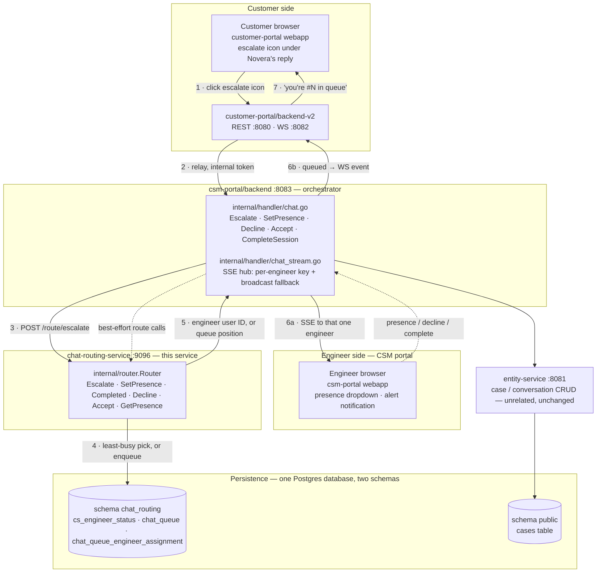

# Chat Routing Service

A standalone Go service that decides **which engineer** (if any) picks up a
live-chat escalation from the customer portal. It sits between
`csm-portal/backend` — which still owns every WebSocket/SSE connection and
every case/session HTTP route — and PostgreSQL, where engineer presence and
the waiting queue are persisted.

Escalations are routed to exactly one engineer — whoever has the most spare
concurrent-chat capacity and is least busy today — instead of being
broadcast to everyone. Anyone who arrives while every engineer is at
capacity waits in a FIFO queue that drains automatically as engineers free
up. Each engineer has a configurable concurrent-chat capacity
(`max_concurrent_chats`, default 1, confirmed with the mentor 2026-09-10 —
see the project's `db-schema-review-2026-09-07-outcomes.md`), so — unlike
the original single-case version of this service — an engineer isn't
blocked from picking up a second (or third, ...) chat while an earlier
customer is slow to respond. A freshly-assigned case is *pending* until the
engineer explicitly calls `POST /route/accept`; "pending" and "which cases
an engineer currently holds" are per-case facts (see
[Data model](#data-model)), not a top-level engineer status — an
engineer's own `chat_status` (`AVAILABLE`/`BUSY`/`OFFLINE`) is now a plain
manual toggle, independent of how many cases they're actually holding.

Engineers are identified throughout this service by their IdP `userid`
claim, not their email — this service stores no user profile data of its
own (see [Data model](#data-model)).

## Architecture



`chat-routing-service` never touches conversation content and never opens a
socket to a client — every call into it is a synchronous HTTP request from
`csm-portal/backend`, and its response is relayed back through whichever
transport `csm-portal/backend` already owns (SSE to engineers, the existing
WebSocket relay to customers). Case and message content stays entirely in
`entity-service`'s own database; this service owns exactly three tables of
its own — see [Data model](#data-model) below.

## Escalation walkthrough

1. **Customer clicks the escalate icon.** It renders directly under any
   Novera reply — the greeting, a normal answer, or an error bubble — not
   only a successfully completed one.
2. **backend-v2 relays it** to `csm-portal/backend` over its existing
   internal-token-authenticated call.
3. **`csm-portal/backend` calls `POST /route/escalate`** on this service.
4. Inside **one Postgres transaction**, the router picks the least-busy
   `AVAILABLE` engineer — see [Assignment priority](#assignment-priority) —
   and either assigns the case to them or, if nobody qualifies, leaves its
   `chat_queue` row `WAITING_FOR_ENGINEER` and computes its position with a
   `(created_at, chat_conversation_id)` tuple-comparison `COUNT(*)` — no
   table lock or stored sequence number needed. A `chat_queue` row is
   created either way (`ASSIGNED` or `WAITING_FOR_ENGINEER`) and lives until
   `Router.Accept` removes it — see [Data model](#data-model). Engineer
   selection still runs `FOR UPDATE` / `FOR UPDATE SKIP LOCKED`, so
   concurrent requests can never be handed the same engineer.
5. The result — an engineer's user ID, or `{queued: true, position: N}` —
   goes back to `csm-portal/backend`.
6. `csm-portal/backend` relays the outcome: an assignment becomes an SSE
   push to that **one** engineer's private hub key (not a broadcast); a
   queue placement becomes a WebSocket event to the customer.
7. The customer sees a plain bot message — "you're #N in the queue" —
   appended to the same chat thread.

Presence changes, session completion, and a dismissed alert all follow the
same shape as steps 3–5, just against `POST /route/presence`,
`POST /route/completed`, and `POST /route/decline` respectively.

## Assignment priority

`Router.Escalate` picks an engineer in this order, falling through to the
next tier only when the previous one comes up empty:

| Priority | Rule | Notes |
|---|---|---|
| 1 · Spare capacity | Whichever `AVAILABLE` engineer has the **fewest currently-active concurrent chats**, and has spare capacity at all (`active chats < max_concurrent_chats`). | "Active" means an `OPEN` or `ACTIVE` `chat_conversation` row assigned to them with `session_ended_at IS NULL` — see [Data model](#data-model). An engineer already at their own `max_concurrent_chats` is never selected, however idle they otherwise look. |
| 2 · Least busy | Among engineers tied on active chats, whoever has **accepted the fewest chats today**. | Computed live with `COUNT(*)` over `chat_conversation` for rows where `assignee_id` matches and `updated_at` falls in `[CURRENT_DATE, CURRENT_DATE + 1)` — not a stored counter, so there's no lazy-reset bookkeeping to get wrong; an engineer with zero rows today is simply `0`. This counts chats **accepted** today, not merely assigned — an engineer who's repeatedly assigned-then-declines doesn't look busier than they really are. |
| 3 · Tie-break | Among engineers still tied, whoever has been `AVAILABLE` the **longest** (`available_since` ascending). | |
| 4 · Queue | If no engineer is `AVAILABLE` with spare capacity, the case's `chat_queue` row stays `WAITING_FOR_ENGINEER` (FIFO by `created_at`). | Once an engineer frees up a slot, they claim the oldest waiting row directly (see `SetPresence` / `Completed` below); least-busy ranking isn't re-applied to queued cases. |

There is no per-customer stickiness — every escalation is routed purely by
current availability and load, never by who handled that customer last.

## Presence state machine

Since the 2026-09-10 concurrent-chat-capacity change, `chat_status`
(`AVAILABLE`/`BUSY`/`OFFLINE`) is a **plain manual toggle**, all three
values directly requestable via `SetPresence`, and completely decoupled
from how many cases an engineer is actually holding. `BUSY` is a real
do-not-disturb — an engineer sets it themselves to stop taking new work
without dropping any case they already hold; it is never set automatically
by an assignment the way it used to be in the original single-case version
of this service.

"Pending" (assigned, not yet accepted) and "which cases an engineer
currently holds" are **per-case facts**, derived from `chat_conversation`
(`assignee_id`, `state`, `accepted_at`, `session_ended_at`), not top-level
engineer state — see [Data model](#data-model). This is what makes holding
several cases at once representable at all: a single "current case" column
on the engineer's own row could never express that.

| From | Request | Result |
|---|---|---|
| any | `AVAILABLE` | joins (or rejoins) the pool (`available_since` set); then claims cases off the `WAITING_FOR_ENGINEER` queue, oldest first, until either it's empty or this engineer's `max_concurrent_chats` is reached — so more than one case can be delivered from a single presence change (see `PresenceResult.assignedCases`) |
| any | `BUSY` | leaves the pool (no new assignments) but takes no action on any case already held — a pure do-not-disturb toggle |
| any | `OFFLINE` | leaves the pool; also takes no action on any case already held — an engineer can be `OFFLINE` while still mid-conversation on cases assigned before they went offline |
| holding a pending case on `caseId` | `POST /route/accept {userId, caseId}` | sets that one conversation's `state = 'ACTIVE'`, `accepted_at = now()`, **deletes the case's `chat_queue` row**, and records a `CONNECTED` row in `chat_queue_engineer_assignment`. Only this case is affected — any other concurrent case this engineer holds is untouched. A stale accept (already declined/reassigned/accepted, or a different `caseId`) reports `{applied:false}` rather than erroring. |
| holding a pending case on `caseId`, too long | (no explicit request — a periodic `POST /route/sweep-timeouts` call finds it) | that one case is reassigned to the next engineer with spare capacity, or its `chat_queue` row flips back to `WAITING_FOR_ENGINEER` if nobody qualifies — same outcome shape as a `Decline`, just triggered by elapsed time instead of the engineer's own click; either way a `TIMED_OUT` row is recorded in `chat_queue_engineer_assignment`. **Unlike the original single-case version of this service, the unresponsive engineer's `chat_status` is left completely untouched** — they may well be mid-conversation on a different concurrent case at the same time, and a timeout on one case is no longer a reason to pull them off everything else. |

**On session completion (`POST /route/completed {userId, caseId}`):** that
one conversation's `session_ended_at` is set. If the engineer is still
`chat_status = AVAILABLE` and now has spare capacity, the router claims one
queued case for them the same way `SetPresence`'s own drain does — but at
most one, since only one slot was just freed (`CompletedResult.
assignedCase`, singular). `chat_status` itself is never touched by this
call.

**On decline** (dismissing an alert before accepting): a `REJECTED` row is
recorded in `chat_queue_engineer_assignment`, that one conversation's
`assignee_id`/`accepted_at` are cleared, then the case is either handed to
the next engineer with spare capacity by the same ranking `Escalate` uses
(excluding the decliner — see [Assignment priority](#assignment-priority)),
or its `chat_queue` row flips back to `WAITING_FOR_ENGINEER`. Because that
row is never deleted and re-inserted — only ever updated in place, from
`Escalate` until `Accept` — it keeps its **original** `created_at`, which is
what puts it ahead of every case that arrived after it without any separate
"front of queue" flag. Declining doesn't affect any of the decliner's other
concurrent cases.

## Data model

In their own `chat_routing` schema, separate from `entity-service`'s flat
`cases` table:

| Table | Holds | Ordering / lookup |
|---|---|---|
| `cs_engineer_status` | `user_id` (PK, the IdP's `userid` claim), `chat_status` (`AVAILABLE`/`BUSY`/`OFFLINE` — a plain manual toggle, see [Presence state machine](#presence-state-machine)), `max_concurrent_chats` (configurable capacity, default `1`, `CHECK` between 1 and 20), `available_since` | `available_since` — oldest-idle-first (assignment-priority tier-3 tie-break) |
| `chat_conversation` | the LOCAL STAND-IN work-item pairing (see [Integrating from another service](#integrating-from-another-service)) — this is now also the **source of truth for which cases an engineer holds**: `case_id`, `assignee_id` (set at assignment time, not just at Accept), `state` (`OPEN` until `Accept` moves it to `ACTIVE`), `accepted_at`, `session_ended_at`, `case_info` (JSONB) | indexed on `(assignee_id, state)` where `assignee_id IS NOT NULL AND session_ended_at IS NULL` — the "active chats" set every capacity check and the timeout sweep scan |
| `chat_queue_engineer_assignment` | one append-only row per assignment **outcome**: `conversation_id`, `engineer_id`, `status` (`CONNECTED`/`REJECTED`/`TIMED_OUT`), `occurred_at` | indexed on `(conversation_id, occurred_at)` and `(engineer_id, occurred_at)`; a pure audit trail of accept/decline/timeout outcomes — it isn't written at assignment time, so it can't answer "how many chats was this engineer assigned today" (see [Assignment priority](#assignment-priority)) |
| `chat_queue` | one row **per active (unaccepted) escalation**, from `Escalate` until `Accept` — `chat_conversation_id` (PK), `case_info` (JSONB), `status` (`WAITING_FOR_ENGINEER`/`ASSIGNED`) | `(created_at, chat_conversation_id)` ascending among `WAITING_FOR_ENGINEER` rows — a fresh case sorts by arrival time, and a reassigned/requeued row keeps its *original* `created_at` (see [Presence state machine](#presence-state-machine)) since it's only ever updated in place, never deleted and re-inserted |

**An engineer no longer has a single `current_case` column** — as of the
2026-09-10 concurrent-chat-capacity change, `cs_engineer_status.
current_case_id`/`current_case`/`accepted_at` were dropped entirely; "which
cases is this engineer holding right now" is answered by querying
`chat_conversation` for rows with `assignee_id = <them>`, `state IN
('OPEN','ACTIVE')`, `session_ended_at IS NULL`, not by a column on the
engineer's own row. This is also why `chat_conversation.case_info` exists:
`assignee_id` is now set at *assignment* time (not only at `Accept`), so
`chat_queue`'s own `case_info` copy — which is deleted the moment `Accept`
removes that row — is no longer enough on its own to keep showing a
case's subject/message/customer name for the rest of an already-accepted
session; `chat_conversation.case_info` is populated once at `CreateWorkItem`
time and outlives `Accept`.

`case_info` is stored as a JSONB blob (`router.CaseInfo` — `caseId`,
`conversationId`, `projectId`, `subject`, `customerEmail`, `customerName`,
`message`) rather than normalized columns, kept for two reasons: this
service never queries *into* that blob by any field other than `caseId`;
and `entity-service`'s real case data lives in a separate service, with
even this feature's own temporary `work_item`/`chat_conversation` stand-in
tables (see
[Integrating from another service](#integrating-from-another-service))
not populated until *after* `Router.Escalate` returns — so a queued or
freshly-drained customer would otherwise lose their subject/message/
customer name with nothing to reconstruct it from. Worth revisiting once
`entity-service`'s real, atomically-created work item ships.

**These tables live in their own `chat_routing` Postgres schema, inside the
*same database* `entity-service` uses** (not a separate database) — see
`internal/config.Schema` and every migration file, which schema-qualifies
its `CREATE`s. `internal/db.NewPool` sets each new connection's
`search_path` to `chat_routing` via pgxpool's `AfterConnect` hook, so every
query in `internal/router` can still use plain unqualified table names
(`cs_engineer_status`, not `chat_routing.cs_engineer_status`) — the schema
resolution happens once per connection, not once per query. A bare
`search_path` DSN query parameter doesn't work for this (libpq/pgx's URI
parser rejects it outright), which is why it's done this way instead of in
the connection string.

Full schema history and rationale for each change lives in
[`migrations/`](./migrations) (one pair of `.up`/`.down` files per change,
each with its own comment) rather than here.

## HTTP surface

All routes below `/route/*` require the `X-Routing-Service-Token` header
(shared secret with `csm-portal/backend`'s `internal/routingclient`).
`GET /health` is unauthenticated, for local liveness checks only.

| Method | Path | Body / params | Response |
|---|---|---|---|
| `POST` | `/route/escalate` | `CaseInfo` fields | `{engineerId}` or `{queued:true, position:N}` |
| `POST` | `/route/presence` | `{userId, status}` — `status` is `AVAILABLE`/`BUSY`/`OFFLINE`, all directly requestable | `{applied, assignedCases?}` — going `AVAILABLE` can drain more than one queued case at once (see [Presence state machine](#presence-state-machine)), so `assignedCases` is a list |
| `POST` | `/route/completed` | `{userId, caseId}` | `{ended, assignedCase?}` — ends this one conversation; `assignedCase` (singular) is set if that freed slot was immediately backfilled |
| `POST` | `/route/decline` | `{userId, caseId}` | `{reassignedTo?, requeued?, assignedCase?}` |
| `POST` | `/route/accept` | `{userId, caseId}` | `{applied}` — moves this one conversation `OPEN` → `ACTIVE`; `false` if stale (see [Presence state machine](#presence-state-machine)) |
| `GET` | `/route/presence/{userId}` | — | `{chatStatus, activeChats, maxConcurrentChats, atCapacity, cases: [{...CaseInfo, pending, assignedAt}], pendingTimeoutSeconds}` — `cases` lists every case this engineer currently holds, pending or accepted alike (defaults to `OFFLINE`/capacity 1/no cases for an unseen engineer) |
| `PATCH` | `/route/capacity` | `{userId, maxConcurrentChats}` (1-20) | `{applied:true}` — sets this engineer's own concurrent-chat capacity (see `router.Router.SetMaxConcurrentChats`); creates their row on first contact like every other engineer-identified call. Never disturbs a case already held: lowering the limit below the current active count just stops new work from routing to them until they fall back under it |
| `GET` | `/route/debug/state` | — | full dump of `cs_engineer_status` (capacity, active/today counts) + `chat_queue`'s waiting rows — verification only |
| `POST` | `/route/sweep-timeouts` | — | runs two independent sweeps and returns both: `{results: [...], abandoned: [...]}`, polled periodically by `csm-portal/backend`. `results` reassigns/requeues any case whose engineer has been pending past `PENDING_TIMEOUT_SECONDS` (only that one case is affected; the engineer's `chat_status` and any other concurrent case they hold are left untouched, see [Presence state machine](#presence-state-machine)). `abandoned` gives up on any case that sat `WAITING_FOR_ENGINEER` — never assigned to anyone at all — past `QUEUE_ABANDON_SECONDS`, deleting its queue row so it can never later be silently claimed by whichever engineer next goes `AVAILABLE` (see [Configuration](#configuration)) |
| `GET` | `/health` | — | `200 OK` |

`userId` is the IdP's stable per-account `userid` claim, everywhere it
appears above.

A storage/database error on any `/route/*` call returns `502` — the real
error is logged server-side (`slog`) and never sent to the caller.

A full OpenAPI 3.0 description of every route above (request/response
schemas, which fields are required, which endpoints are the temporary
stand-in ones) lives in [`openapi.yaml`](./openapi.yaml) alongside this
file.

## Integrating from another service

**The plain HTTP API above is the primary integration surface** — any
service, in any language, can call it directly with nothing more than the
base URL and a copy of `ROUTING_SERVICE_TOKEN`. `apps/chat-routing-service/
sdk-go` (a thin Go client wrapping these same routes) exists purely as a
convenience for `csm-portal/backend`, today's only real caller — it carries
no logic of its own, adds no capability the raw API doesn't already have,
and is optional. A non-Go consumer, or a Go service that would rather not
take the dependency, should build straight against `openapi.yaml` and the
[HTTP surface](#http-surface) table instead.

Two things any new consumer should treat as a real contract, not an
implementation detail: the `X-Routing-Service-Token` header is a static
server-to-server secret and must never be constructed in, or proxied out
to, browser-facing code (see [Configuration](#configuration)); and the
`/route/workitem`, `/route/comment`, and `/route/debug/*` routes are an
explicitly temporary stand-in (see this repo's `internal/router/
workitem.go`) — a new integration should confirm with this service's owner
before depending on their shape.

## Configuration

Loaded from the environment (a `.env` file is read first if present — see
`.env.example`):

| Variable | Meaning |
|---|---|
| `ROUTING_SERVICE_PORT` | bare port number, default `9096` |
| `ROUTING_SERVICE_TOKEN` | shared secret; must match `csm-portal/backend`'s value |
| `PENDING_TIMEOUT_SECONDS` | how long (seconds) a case can sit assigned-but-unconfirmed before `POST /route/sweep-timeouts` reassigns/requeues it — only that one case is affected, not the engineer's `chat_status` or any other concurrent case they hold; default `90` |
| `QUEUE_ABANDON_SECONDS` | how long (seconds) a case can sit `WAITING_FOR_ENGINEER` — never assigned to anyone at all, e.g. every engineer was `OFFLINE`/`BUSY`/at capacity when it arrived — before `POST /route/sweep-timeouts` gives up on it; default `1800` (30 minutes, deliberately much longer than `PENDING_TIMEOUT_SECONDS` since this bounds how long a customer should realistically keep waiting with nobody free at all, not one engineer's accept window). Without this, an old queued case could sit forever and later be silently claimed — and consume a slot of — whichever engineer next went `AVAILABLE`, indistinguishable from a fresh escalation on their screen |
| `DB_HOST`, `DB_PORT`, `DB_NAME` | **point these at the same database `entity-service` uses** — this service's tables live in their own Postgres schema (see [Data model](#data-model)), not a separate database, so there's nothing dedicated to stand up here |
| `DB_USER`, `DB_PASSWORD` | credentials for that database — reusing `entity-service`'s own user is fine for local dev; a narrower-scoped role needs the grants noted in [Running locally](#running-locally) |
| `DB_SSLMODE` | default `disable` (local dev) |

Note: "today" for `chat_conversation`'s live chat count is `CURRENT_DATE` as
the database server sees it — if that server isn't in UTC, the day boundary
falls at that server's local midnight, not the customer's or engineer's.

## Running locally

No `CREATE DATABASE` step — this service reuses `entity-service`'s
database, which already exists if you've set that service up. Two things
to get right when applying migrations here for the first time:

```bash
# 1. If DB_USER isn't already an owner/superuser on that database, grant it
#    just enough to create and use the chat_routing schema (CREATE SCHEMA
#    itself only needs CREATE privilege on the database, which a plain
#    CREATEDB-less role won't have by default):
psql -U <admin-user> -h localhost -d <entity-service-db-name> -c \
  "GRANT CREATE ON DATABASE <entity-service-db-name> TO <db-user>;"

# 2. Apply migrations with a DISTINCT migrations-tracking table name --
#    golang-migrate's default "schema_migrations" table would otherwise
#    collide with entity-service's own migration history in the same
#    database (both start numbering from 000001):
migrate -path migrations \
  -database "postgres://<db-user>:<db-password>@localhost:5432/<entity-service-db-name>?sslmode=disable&x-migrations-table=chat_routing_schema_migrations" \
  up

# run
go run ./cmd/server
```

`GET /route/debug/state` on a freshly migrated database should show empty
`engineers`, `available`, and `queue`.

## Resilience & known limitations

- **Routing-service-down fallback:** if this service is unreachable,
  `csm-portal/backend` falls back to its old broadcast-to-every-connected-
  engineer SSE key for `Escalate`, so a customer is never silently stranded.
  Presence/completed/decline calls don't need this — they aren't
  "a customer needs to reach someone right now" moments — and are
  best-effort/logged on failure instead.
- **No timeout or reassignment** if an assigned engineer never accepts the
  session or goes unreachable — a prototype gap that predates and is
  unrelated to persistence.
- **One database, not two.** This service shares `entity-service`'s actual
  database, isolated at the schema level (`chat_routing` vs `public`)
  rather than the database level — one less database to create, back up,
  and reason about, at the cost of the two services' data no longer failing
  independently of each other (an `entity-service`-database incident, e.g.
  a bad migration or a restore, now affects this service's state too).
- **`chat_queue.case_info` duplicates data conceptually owned elsewhere** —
  see [Data model](#data-model). A known, flagged tradeoff of this
  feature's temporary persistence, not an oversight; revisit once
  `entity-service`'s real work-item schema ships.
- **Single-process is the only tested topology.** Every state transition is
  a Postgres transaction rather than an in-process mutex, so multiple
  replicas of this service *should* be safe against the same database, but
  that hasn't been load-tested.
- Restarting this service does not lose in-flight routing state — that's
  the reason it's backed by Postgres rather than an in-memory map.

## Related

- `apps/csm-portal/backend/internal/routingclient` — the (only) caller of
  this service's HTTP surface.
- `apps/csm-portal/backend/internal/handler/chat.go` and `chat_stream.go` —
  where the SSE fan-out and WebSocket relay this service's decisions ride on
  actually live.
- `docs/architecture.excalidraw` — a hand-drawn version of an earlier cut of
  this diagram, kept for whiteboard-style walkthroughs. It predates the
  least-busy-only assignment logic above, so it still shows plain FIFO
  assignment and a sticky-routing tier that no longer exists.
