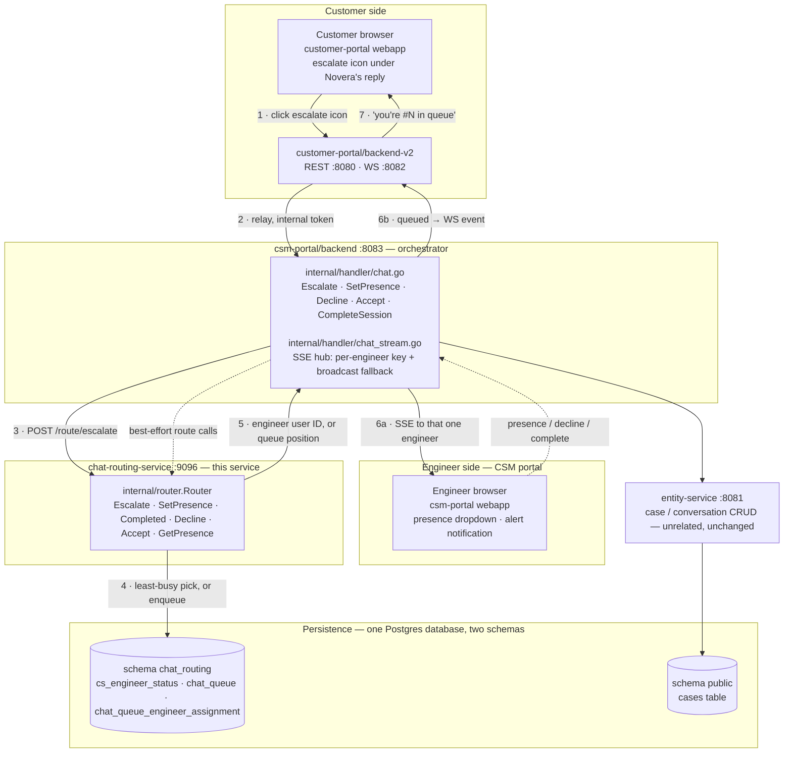

# Chat Routing Service

A standalone Go service that decides **which engineer** (if any) picks up a
live-chat escalation from the customer portal. It sits between
`csm-portal/backend` — which still owns every WebSocket/SSE connection and
every case/session HTTP route — and PostgreSQL, where engineer presence and
the waiting queue are persisted.

Before this service existed, an escalation was broadcast to *every*
connected engineer and "accepting" was first-`PATCH`-wins. This service
replaces that with real state: engineers declare themselves
`AVAILABLE` / `OFFLINE` (`PENDING` and `BUSY` are derived, never a direct
request — see below), an escalation is routed to exactly one engineer —
whoever's least busy today — and anyone who arrives while all engineers
are busy waits in a FIFO queue that drains automatically as engineers free
up. An assigned engineer shows `PENDING` (capacity reserved, alert not yet
acted on) until they explicitly call `POST /route/accept`, only then
becoming `BUSY` — the CSM portal's status bar never shows Busy before the
engineer has actually accepted the case.

Engineers are identified throughout this service by their IdP `userid`
claim, not their email — see the 2026-09-07 DB schema review note in
[Data model](#data-model) below.

## Architecture



`chat-routing-service` never touches conversation content and never opens a
socket to a client — every call into it is a synchronous HTTP request from
`csm-portal/backend`, and its response is relayed back through whichever
transport `csm-portal/backend` already owns (SSE to engineers, the existing
WebSocket relay to customers). Case and message content stays entirely in
`entity-service`'s own database; this service owns exactly three tables of
its own — see [Data model](#data-model) below.

## Escalation walkthrough

1. **Customer clicks the escalate icon.** It renders directly under any
   Novera reply — the greeting, a normal answer, or an error bubble — not
   only a successfully completed one.
2. **backend-v2 relays it** to `csm-portal/backend` over its existing
   internal-token-authenticated call.
3. **`csm-portal/backend` calls `POST /route/escalate`** on this service.
4. Inside **one Postgres transaction**, the router picks the least-busy
   `AVAILABLE` engineer — see [Assignment priority](#assignment-priority) —
   and either assigns the case to them or, if nobody qualifies, leaves its
   `chat_queue` row `WAITING_FOR_ENGINEER` and computes its position with a
   `(created_at, chat_conversation_id)` tuple-comparison `COUNT(*)` — no
   table lock or stored sequence number needed. A `chat_queue` row is
   created either way (`ASSIGNED` or `WAITING_FOR_ENGINEER`) and lives until
   `Router.Accept` removes it — see [Data model](#data-model). Engineer
   selection still runs `FOR UPDATE` / `FOR UPDATE SKIP LOCKED`, so
   concurrent requests can never be handed the same engineer.
5. The result — an engineer's user ID, or `{queued: true, position: N}` —
   goes back to `csm-portal/backend`.
6. `csm-portal/backend` relays the outcome: an assignment becomes an SSE
   push to that **one** engineer's private hub key (not a broadcast); a
   queue placement becomes a WebSocket event to the customer.
7. The customer sees a plain bot message — "you're #N in the queue" —
   appended to the same chat thread.

Presence changes, session completion, and a dismissed alert all follow the
same shape as steps 3–5, just against `POST /route/presence`,
`POST /route/completed`, and `POST /route/decline` respectively.

## Assignment priority

`Router.Escalate` picks an engineer in this order, falling through to the
next tier only when the previous one comes up empty:

| Priority | Rule | Notes |
|---|---|---|
| 1 · Least busy | Whichever `AVAILABLE` engineer has **accepted the fewest chats today**. | Computed live with `COUNT(*)` over `chat_conversation` for rows where `assignee_id` matches and `updated_at` falls in `[CURRENT_DATE, CURRENT_DATE + 1)` — not a stored counter, so there's no lazy-reset bookkeeping to get wrong; an engineer with zero rows today is simply `0`. **Note the metric change:** this used to count chats **assigned** today (via the now-removed `assignment_log`); since `chat_conversation.assignee_id` is only set once an engineer actually accepts (`setConversationAssignee`), it now counts chats **accepted** today instead — an engineer who's repeatedly assigned-then-declined no longer looks busier than they really are. Deliberate, not an oversight — see `migrations/000011_drop_assignment_log.up.sql`. |
| 2 · Tie-break | Among engineers tied on chats today, whoever has been `AVAILABLE` the **longest** (`available_since` ascending). | This is the same "came online first" ordering the original FIFO design used for everyone — now it only kicks in on a tie. |
| 3 · Queue | If no engineer is `AVAILABLE` at all, the case's `chat_queue` row stays `WAITING_FOR_ENGINEER` (FIFO by `created_at`). | Once an engineer frees up, they claim the oldest waiting row directly (see `SetPresence` / `Completed` below); least-busy ranking isn't re-applied to queued cases. |

A per-customer "sticky" preference — try to route a returning customer back
to whoever last handled them — used to run before tier 1 above. It was
dropped in the 2026-09-07 DB schema review as fully derivable, unnecessary
state to maintain — see `migrations/000013_drop_customer_engineer_assignments.up.sql`
and [Data model](#data-model)'s schema-review note.

`chat_queue_engineer_assignment` is **not** written at assignment time — it
records the *outcome* of an assignment instead (`CONNECTED` on `Accept`,
`REJECTED` on `Decline`, `TIMED_OUT` on a sweep), which is what makes it
unsuitable for the least-busy metric above — see
[Data model](#data-model). `Decline`'s own reassignment step reuses tiers
1/2 (least-busy, tie-broken by online time) excluding the declining
engineer.

## Presence state machine

`PENDING` and `BUSY` are never a direct `SetPresence` request — only
`AVAILABLE`/`OFFLINE` are. Both count as "has a current case" for every
check below (mid-session handling, `Decline`'s own-case check); the only
thing that separates them is `Router.Accept`.

**Internal representation note:** `cs_engineer_status.chat_status` itself
only ever stores `AVAILABLE`, `BUSY`, or `OFFLINE` — `PENDING` was removed
as a storable enum value (see
`migrations/000012_remove_pending_status.up.sql`). Whether a `BUSY`
engineer is actually still `PENDING` is derived from a nullable
`accepted_at` timestamp (`NULL` = reserved but not yet accepted, set =
accepted) via `isPendingAccept`/`externalStatus` in `state.go`. This is
purely an internal storage detail — every HTTP response below still
reports `PENDING` exactly as it always has.

| From | Request | Result |
|---|---|---|
| any, idle | `AVAILABLE` | joins the pool (`available_since` set); if the queue has a `WAITING_FOR_ENGINEER` row, immediately claims the oldest one and assigns it (engineer becomes `PENDING`, not `BUSY` — see `Accept` below) |
| any, idle | `OFFLINE` | out of the pool |
| mid-session (`PENDING` or `BUSY`, `current_case` set) | `OFFLINE` requested | **deferred** — `pending_offline` is set, engineer stays `PENDING`/`BUSY` until the session ends |
| mid-session | `AVAILABLE` requested | just clears `pending_offline` if it was set; the session itself is untouched (one dedicated session, can't free early) |
| `PENDING` on `caseId` | `POST /route/accept {userId, caseId}` | flips to `BUSY` (internally: sets `accepted_at = now()`), **deletes the case's `chat_queue` row**, and a `CONNECTED` row is recorded in `chat_queue_engineer_assignment`. A stale accept (already declined/reassigned/accepted, or a different `caseId`) reports `{applied:false}` rather than erroring — see `Router.Accept`'s own doc comment. |
| `PENDING` on `caseId`, too long | (no explicit request — a periodic `POST /route/sweep-timeouts` call finds it) | the engineer is taken `OFFLINE` (not re-queued as available — they didn't respond, so immediately handing them another case would likely repeat the timeout) and the case is reassigned to the next available engineer, or its `chat_queue` row flips back to `WAITING_FOR_ENGINEER` if nobody's free — same outcome shape as a `Decline`, just triggered by elapsed time instead of the engineer's own click; either way a `TIMED_OUT` row is recorded in `chat_queue_engineer_assignment` |

**On session completion:** if `pending_offline` was set, the engineer goes
straight to `OFFLINE` and does **not** rejoin the pool or take a queued
case. Otherwise, the engineer becomes `AVAILABLE`, rejoins the pool, and the
router immediately tries to claim the queue's oldest waiting row (again as
`PENDING`).

**On decline** (dismissing an alert before accepting): a `REJECTED` row is
recorded in `chat_queue_engineer_assignment`, the declining engineer is
freed exactly like a completion, then the case is either handed to the
next-best available engineer by the same least-busy/tie-break ranking
(excluding the decliner, and again assigned as `PENDING` — the
`chat_queue` row stays `ASSIGNED`, just to someone else), or its
`chat_queue` row flips back to `WAITING_FOR_ENGINEER`. Because that row is
never deleted and re-inserted — only ever updated in place, from Escalate
until Accept — it keeps its **original** `created_at`, which is what puts
it ahead of every case that arrived after it without any separate
"front of queue" flag.

## Data model

Three tables, in their own schema, separate from `entity-service`'s flat
`cases` table:

| Table | Holds | Ordering / lookup |
|---|---|---|
| `cs_engineer_status` | `user_id` (PK), `chat_status` (`AVAILABLE`/`BUSY`/`OFFLINE` only — `PENDING` is derived, see [Presence state machine](#presence-state-machine)), `pending_offline`, `current_case_id` / `current_case` (JSONB), `accepted_at`, `available_since` | `available_since` — oldest-idle-first (tier-2 tie-break) |
| `chat_queue_engineer_assignment` | one append-only row per assignment **outcome**: `conversation_id`, `engineer_id`, `status` (`CONNECTED`/`REJECTED`/`TIMED_OUT`), `occurred_at` | indexed on `(conversation_id, occurred_at)` and `(engineer_id, occurred_at)`; a pure audit trail of accept/decline/timeout outcomes — see the note below on why least-busy ranking doesn't read this table |
| `chat_queue` | one row **per active (unaccepted) escalation**, from `Escalate` until `Accept` — `chat_conversation_id` (PK), `case_info` (JSONB), `status` (`WAITING_FOR_ENGINEER`/`ASSIGNED`) | `(created_at, chat_conversation_id)` ascending among `WAITING_FOR_ENGINEER` rows — a fresh case sorts by arrival time, and a reassigned/requeued row keeps its *original* `created_at` (see [Presence state machine](#presence-state-machine)) since it's only ever updated in place, never deleted and re-inserted |

**2026-09-07 DB schema review.** A meeting that day (Sajith Ekanayaka,
Mifraz Murthaja) reviewed this schema end to end — see the project's
`db-schema-review-2026-09-07-outcomes.md` doc for the full account. Three
outcomes landed here:

- **`customer_engineer_assignments` ("sticky routing") is gone.** Confirmed
  fully derivable, not state this service needs to maintain — see
  `migrations/000013_drop_customer_engineer_assignments.up.sql`.
- **`engineers` is now `cs_engineer_status`, keyed by `user_id`, with no
  `email` column at all.** `user_id` is the IdP's stable per-account
  `userid` claim (`csm-portal/backend`'s `middleware.UserInfo.UserID`) —
  the same value this table's PK already stored as `engineer_id` before
  this migration, just without a separate `email` column alongside it
  ("we don't need to store email here because it's there in the user
  table"). Every route, the SDK, and every caller now identify an engineer
  by this ID — see [HTTP surface](#http-surface) and
  `migrations/000014_rename_engineer_status_table.up.sql`.
- **`chat_queue` was redesigned**, per the table above — no more bigserial
  `id`, `requeued`, or "pop the head" delete-on-assignment; one row exists
  per escalation from `Escalate` until `Accept`, and reassignment is a
  plain status flip. See
  `migrations/000015_redesign_chat_queue.up.sql`.

**Deliberate deviation: `case_info` stays a JSONB blob on `chat_queue`.**
The review's own conclusion was that this duplicates data already in "the
case table" and should be dropped. That's true once a real, queryable
case/work-item table exists to read from at dequeue time — this service
doesn't have one: `entity-service`'s real case data lives in a separate
service, and even this feature's own LOCAL STAND-IN `work_item`/
`chat_conversation` tables (see below) aren't populated until *after*
`Router.Escalate` returns. Dropping `case_info` here with nothing to
reconstruct it from would mean a queued (or freshly-drained) customer loses
their subject/message/customer name. Kept for that reason — see the
migration's own doc comment — and worth revisiting once the LOCAL STAND-IN
tables are retired in favor of `entity-service`'s real, atomically-created
work item.

**Least-busy ranking (tier 1 in [Assignment priority](#assignment-priority)) reads `chat_conversation`, not this schema's own tables.** `chat_queue_engineer_assignment` replaced the old `assignment_log`, but — as the table above says — its rows are written at accept/decline/timeout time, not at assignment time, so it can't answer "how many chats was this engineer assigned today" the way `assignment_log` could. `popAvailableEngineer` instead counts rows in `entity-service`'s temporary stand-in `chat_conversation` table (see below) with a matching `assignee_id` and `updated_at` today, which counts chats an engineer has **accepted** today rather than **assigned** — a deliberate, flagged trade-off, not an oversight; see `migrations/000011_drop_assignment_log.up.sql`'s comment for the full reasoning.

`case_info` / `current_case` are stored as JSONB blobs (`router.CaseInfo` —
`caseId`, `conversationId`, `projectId`, `subject`, `customerEmail`,
`customerName`, `message`) rather than normalized columns: this service
never queries *into* that blob by any field other than `caseId`
(`current_case`) or `conversationId` (`case_info`, keyed by
`chat_conversation_id`), and it means `csm-portal/backend` can add a field
without a migration here.

**These tables live in their own `chat_routing` Postgres schema, inside the
*same database* `entity-service` uses** (not a separate database) — see
`internal/config.Schema` and every migration file, which schema-qualifies
its `CREATE`s. `internal/db.NewPool` sets each new connection's
`search_path` to `chat_routing` via pgxpool's `AfterConnect` hook, so every
query in `internal/router` can still use plain unqualified table names
(`cs_engineer_status`, not `chat_routing.cs_engineer_status`) — the schema
resolution happens once per connection, not once per query. A bare
`search_path` DSN query parameter doesn't work for this (libpq/pgx's URI
parser rejects it outright), which is why it's done this way instead of in
the connection string.

See `migrations/000001_create_engineers.up.sql`,
`migrations/000002_create_escalation_queue.up.sql`,
`migrations/000003_add_sticky_routing_and_chat_counts.up.sql`,
`migrations/000004_engineer_id_primary_key.up.sql`,
`migrations/000005_dynamic_chat_counts.up.sql` (drops the old
`chats_today`/`chats_today_date` columns in favor of `assignment_log`),
`migrations/000006_add_pending_status.up.sql` (adds the `PENDING` enum
value), and
`migrations/000007_create_chat_stub_workitem_tables.up.sql` (the temporary
`work_item`/`chat_conversation`/`comment` stand-in tables — see
[Integrating from another service](#integrating-from-another-service))
for that earlier schema, including the check constraints that keep
`current_case_id`/`current_case` consistent and `available_since`
meaningful only while truly idle-and-free.

A later round of schema-review changes is spread across four more
migrations: `migrations/000008_rename_chat_queue_drop_order_key.up.sql`
(`escalation_queue` → `chat_queue`, `order_key` → `requeued` — `requeued`
was itself dropped again by 000015 below),
`migrations/000009_create_chat_queue_engineer_assignment.up.sql` (the new
outcome-audit table replacing `assignment_log`),
`migrations/000010_chat_conversation_state.up.sql` (adds
`chat_conversation.state`, drops its unused `conversation_id` column), and
`migrations/000011_drop_assignment_log.up.sql` (drops `assignment_log` —
see the least-busy-metric note above).

A final round, from the 2026-09-07 schema review itself, is
`migrations/000012_remove_pending_status.up.sql` (adds
`cs_engineer_status.accepted_at`, née `engineers.accepted_at`, and rebuilds
the status enum without `PENDING` — see [Presence state machine](#presence-state-machine)'s
internal-representation note),
`migrations/000013_drop_customer_engineer_assignments.up.sql`,
`migrations/000014_rename_engineer_status_table.up.sql`, and
`migrations/000015_redesign_chat_queue.up.sql` — the three schema-review
outcomes described above.

## HTTP surface

All routes below `/route/*` require the `X-Routing-Service-Token` header
(shared secret with `csm-portal/backend`'s `internal/routingclient`).
`GET /health` is unauthenticated, for local liveness checks only.

| Method | Path | Body / params | Response |
|---|---|---|---|
| `POST` | `/route/escalate` | `CaseInfo` fields | `{engineerId}` or `{queued:true, position:N}` |
| `POST` | `/route/presence` | `{userId, status}` | `{applied, pendingOffline?, assignedCase?}` |
| `POST` | `/route/completed` | `{userId}` | `{removed, rejoined, assignedCase?}` |
| `POST` | `/route/decline` | `{userId, caseId}` | `{reassignedTo?, requeued?}` |
| `POST` | `/route/accept` | `{userId, caseId}` | `{applied}` — `PENDING` → `BUSY`; `false` if stale (see [Presence state machine](#presence-state-machine)) |
| `GET` | `/route/presence/{userId}` | — | `{status, currentCase?, pendingSince?, pendingTimeoutSeconds}` (defaults to `OFFLINE`, no case, for an unseen engineer; `currentCase`/`pendingSince` set when `PENDING`; `currentCase` also set when `BUSY`; `pendingTimeoutSeconds` always present) |
| `GET` | `/route/debug/state` | — | full dump of `cs_engineer_status` (incl. today's chat count) + `chat_queue`'s waiting rows — verification only |
| `POST` | `/route/sweep-timeouts` | — | reassigns/requeues any case whose engineer has been `PENDING` past `PENDING_TIMEOUT_SECONDS`, taking them `OFFLINE` — `{results: [...]}`, polled periodically by `csm-portal/backend` (see [Presence state machine](#presence-state-machine)) |
| `GET` | `/health` | — | `200 OK` |

`userId` is the IdP's stable per-account `userid` claim, everywhere it
appears above — see [Data model](#data-model)'s schema-review note.
`POST /route/presence` used to also require an `engineerId` field (to
populate a new row's PK the first time an email was seen); now that
`cs_engineer_status` is keyed by `userId` directly, there is nothing else
to supply on first contact.

A storage/database error on any `/route/*` call returns `502` — the real
error is logged server-side (`slog`) and never sent to the caller.

A full OpenAPI 3.0 description of every route above (request/response
schemas, which fields are required, which endpoints are the temporary
stand-in ones) lives in [`openapi.yaml`](./openapi.yaml) alongside this
file.

## Integrating from another service

**The plain HTTP API above is the primary integration surface** — any
service, in any language, can call it directly with nothing more than the
base URL and a copy of `ROUTING_SERVICE_TOKEN`. `apps/chat-routing-service/
sdk-go` (a thin Go client wrapping these same routes) exists purely as a
convenience for `csm-portal/backend`, today's only real caller — it carries
no logic of its own, adds no capability the raw API doesn't already have,
and is optional. A non-Go consumer, or a Go service that would rather not
take the dependency, should build straight against `openapi.yaml` and the
[HTTP surface](#http-surface) table instead.

Two things any new consumer should treat as a real contract, not an
implementation detail: the `X-Routing-Service-Token` header is a static
server-to-server secret and must never be constructed in, or proxied out
to, browser-facing code (see [Configuration](#configuration)); and the
`/route/workitem`, `/route/comment`, and `/route/debug/*` routes are an
explicitly temporary stand-in (see this repo's `internal/router/
workitem.go`) — a new integration should confirm with this service's owner
before depending on their shape.

## Configuration

Loaded from the environment (a `.env` file is read first if present — see
`.env.example`):

| Variable | Meaning |
|---|---|
| `ROUTING_SERVICE_PORT` | bare port number, default `9096` |
| `ROUTING_SERVICE_TOKEN` | shared secret; must match `csm-portal/backend`'s value |
| `PENDING_TIMEOUT_SECONDS` | how long (seconds) an engineer can sit `PENDING` before `POST /route/sweep-timeouts` reassigns/requeues their case and takes them `OFFLINE`; default `90` |
| `DB_HOST`, `DB_PORT`, `DB_NAME` | **point these at the same database `entity-service` uses** — this service's tables live in their own Postgres schema (see [Data model](#data-model)), not a separate database, so there's nothing dedicated to stand up here |
| `DB_USER`, `DB_PASSWORD` | credentials for that database — reusing `entity-service`'s own user is fine for local dev; a narrower-scoped role needs the grants noted in [Running locally](#running-locally) |
| `DB_SSLMODE` | default `disable` (local dev) |

Note: "today" for `chat_conversation`'s live chat count is `CURRENT_DATE` as
the database server sees it — if that server isn't in UTC, the day boundary
falls at that server's local midnight, not the customer's or engineer's.

## Running locally

No `CREATE DATABASE` step — this service reuses `entity-service`'s
database, which already exists if you've set that service up. Two things
to get right when applying migrations here for the first time:

```bash
# 1. If DB_USER isn't already an owner/superuser on that database, grant it
#    just enough to create and use the chat_routing schema (CREATE SCHEMA
#    itself only needs CREATE privilege on the database, which a plain
#    CREATEDB-less role won't have by default):
psql -U <admin-user> -h localhost -d <entity-service-db-name> -c \
  "GRANT CREATE ON DATABASE <entity-service-db-name> TO <db-user>;"

# 2. Apply migrations with a DISTINCT migrations-tracking table name --
#    golang-migrate's default "schema_migrations" table would otherwise
#    collide with entity-service's own migration history in the same
#    database (both start numbering from 000001):
migrate -path migrations \
  -database "postgres://<db-user>:<db-password>@localhost:5432/<entity-service-db-name>?sslmode=disable&x-migrations-table=chat_routing_schema_migrations" \
  up

# run
go run ./cmd/server
```

`GET /route/debug/state` on a freshly migrated database should show empty
`engineers`, `available`, and `queue`.

## Resilience & known limitations

- **Routing-service-down fallback:** if this service is unreachable,
  `csm-portal/backend` falls back to its old broadcast-to-every-connected-
  engineer SSE key for `Escalate`, so a customer is never silently stranded.
  Presence/completed/decline calls don't need this — they aren't
  "a customer needs to reach someone right now" moments — and are
  best-effort/logged on failure instead.
- **No timeout or reassignment** if an assigned engineer never accepts the
  session or goes unreachable — a prototype gap that predates and is
  unrelated to persistence.
- **One database, not two.** This service originally had its own separate
  `chat_routing` database on the same Postgres server as `entity-service`.
  It now shares `entity-service`'s actual database instead, isolated at the
  schema level (`chat_routing` vs `public`) rather than the database level
  — one less database to create, back up, and reason about, at the cost of
  the two services' data no longer failing independently of each other
  (a `entity-service`-database incident, e.g. a bad migration or a restore,
  now affects this service's state too).
- **`chat_queue.case_info` still duplicates data conceptually owned
  elsewhere** — see [Data model](#data-model)'s deviation note. A known,
  flagged tradeoff of this feature's LOCAL STAND-IN persistence, not an
  oversight; revisit once `entity-service`'s real work-item schema ships.
- **Single-process is the only tested topology.** Every state transition is
  a Postgres transaction rather than an in-process mutex, so multiple
  replicas of this service *should* be safe against the same database, but
  that hasn't been load-tested.
- Restarting this service no longer loses in-flight routing state — that's
  the reason it moved off an in-memory map onto Postgres.

## Related

- `apps/csm-portal/backend/internal/routingclient` — the (only) caller of
  this service's HTTP surface.
- `apps/csm-portal/backend/internal/handler/chat.go` and `chat_stream.go` —
  where the SSE fan-out and WebSocket relay this service's decisions ride on
  actually live.
- `docs/architecture.excalidraw` — a hand-drawn version of an earlier cut of
  this diagram, for whiteboard-style walkthroughs (predates the
  least-busy-only assignment logic above — the queue/broadcast-fallback
  shape is unchanged, but it still shows plain FIFO assignment and a sticky
  routing tier that no longer exists).
