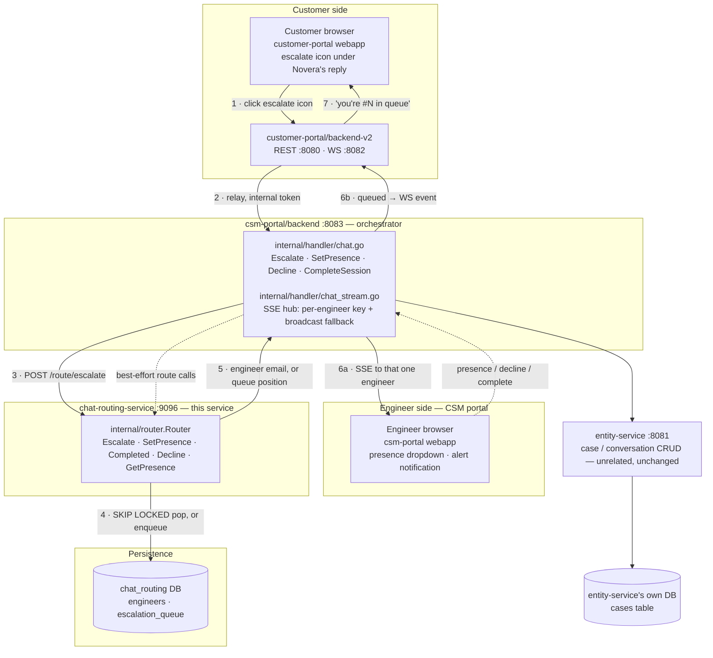

# Chat Routing Service

A standalone Go service that decides **which engineer** (if any) picks up a
live-chat escalation from the customer portal. It sits between
`csm-portal/backend` — which still owns every WebSocket/SSE connection and
every case/session HTTP route — and PostgreSQL, where engineer presence and
the waiting queue are persisted.

Before this service existed, an escalation was broadcast to *every*
connected engineer and "accepting" was first-`PATCH`-wins. This service
replaces that with real state: engineers declare themselves
`AVAILABLE` / `BUSY` / `OFFLINE`, an escalation is routed to exactly one
available engineer, and anyone who arrives while all engineers are busy
waits in a FIFO queue that drains automatically as engineers free up.

## Architecture



`chat-routing-service` never touches conversation content and never opens a
socket to a client — every call into it is a synchronous HTTP request from
`csm-portal/backend`, and its response is relayed back through whichever
transport `csm-portal/backend` already owns (SSE to engineers, the existing
WebSocket relay to customers). Case and message content stays entirely in
`entity-service`'s own database; this service owns exactly two tables of its
own — see [Data model](#data-model) below.

## Escalation walkthrough

1. **Customer clicks the escalate icon.** It renders directly under any
   Novera reply — the greeting, a normal answer, or an error bubble — not
   only a successfully completed one.
2. **backend-v2 relays it** to `csm-portal/backend` over its existing
   internal-token-authenticated call.
3. **`csm-portal/backend` calls `POST /route/escalate`** on this service.
4. Inside **one Postgres transaction**, the router either pops the
   longest-idle available engineer with `FOR UPDATE SKIP LOCKED`, or appends
   the case to `escalation_queue` under a table lock and computes its
   position. This is what makes it safe for multiple `csm-portal/backend`
   (or even multiple routing-service) instances to hit this concurrently —
   two requests can never be handed the same engineer or double-count a
   queue slot.
5. The result — an engineer's email, or `{queued: true, position: N}` — goes
   back to `csm-portal/backend`.
6. `csm-portal/backend` relays the outcome: an assignment becomes an SSE
   push to that **one** engineer's private hub key (not a broadcast); a
   queue placement becomes a WebSocket event to the customer.
7. The customer sees a plain bot message — "you're #N in the queue" —
   appended to the same chat thread.

Presence changes, session completion, and a dismissed alert all follow the
same shape as steps 3–5, just against `POST /route/presence`,
`POST /route/completed`, and `POST /route/decline` respectively.

## Presence state machine

| From | Request | Result |
|---|---|---|
| any, idle | `AVAILABLE` | joins the pool (`available_since` set); if the queue is non-empty, immediately pops the head and assigns it (engineer becomes `BUSY`) |
| any, idle | `BUSY` | manual "do not disturb" — out of the pool, no case |
| any, idle | `OFFLINE` | out of the pool |
| mid-session (`current_case` set) | `OFFLINE` requested | **deferred** — `pending_offline` is set, engineer stays `BUSY` until the session ends |
| mid-session | `AVAILABLE`/`BUSY` requested | just clears `pending_offline` if it was set; the session itself is untouched (one dedicated session, can't free early) |

**On session completion:** if `pending_offline` was set, the engineer goes
straight to `OFFLINE` and does **not** rejoin the pool or take a queued
case. Otherwise, the engineer becomes `AVAILABLE`, rejoins the pool, and the
router immediately tries to hand them the queue head.

**On decline** (dismissing an alert before accepting): the declining
engineer is freed exactly like a completion, then the case is either handed
to another available engineer (excluding the decliner) or pushed back onto
the **front** of the queue — the customer already waited once.

## Data model

Two tables, in their own database (`chat_routing`), separate from
`entity-service`'s database and its flat `cases` table:

| Table | Holds | Ordering |
|---|---|---|
| `engineers` | `status`, `pending_offline`, `current_case_id` / `current_case` (JSONB), `available_since` | `available_since` — oldest-idle-first; no separate in-memory list needed |
| `escalation_queue` | waiting cases (`case_id`, `case_info` JSONB) | `order_key` — appended at the tail; a decline re-inserts at the head |

`case_info` / `current_case` are stored as JSONB blobs (`router.CaseInfo` —
`caseId`, `conversationId`, `projectId`, `subject`, `customerEmail`,
`customerName`, `message`) rather than normalized columns: this service
never queries by any of those fields except `caseId`, and it means
`csm-portal/backend` can add a field without a migration here.

See `migrations/000001_create_engineers.up.sql` and
`migrations/000002_create_escalation_queue.up.sql` for the exact schema,
including the check constraints that keep `current_case_id`/`current_case`
consistent and `available_since` meaningful only while truly idle-and-free.

## HTTP surface

All routes below `/route/*` require the `X-Routing-Service-Token` header
(shared secret with `csm-portal/backend`'s `internal/routingclient`).
`GET /health` is unauthenticated, for local liveness checks only.

| Method | Path | Body / params | Response |
|---|---|---|---|
| `POST` | `/route/escalate` | `CaseInfo` fields | `{engineerEmail}` or `{queued:true, position:N}` |
| `POST` | `/route/presence` | `{email, status}` | `{applied, pendingOffline?, assignedCase?}` |
| `POST` | `/route/completed` | `{email}` | `{removed, rejoined, assignedCase?}` |
| `POST` | `/route/decline` | `{email, caseId}` | `{reassignedTo?, requeued?}` |
| `GET` | `/route/presence/{email}` | — | `{status}` (defaults to `OFFLINE` for an unseen engineer) |
| `GET` | `/route/debug/state` | — | full dump of `engineers` + `escalation_queue` — verification only |
| `GET` | `/health` | — | `200 OK` |

A storage/database error on any `/route/*` call returns `502` — the real
error is logged server-side (`slog`) and never sent to the caller.

## Configuration

Loaded from the environment (a `.env` file is read first if present — see
`.env.example`):

| Variable | Meaning |
|---|---|
| `ROUTING_SERVICE_PORT` | bare port number, default `9096` |
| `ROUTING_SERVICE_TOKEN` | shared secret; must match `csm-portal/backend`'s value |
| `DB_HOST`, `DB_PORT` | this service's own Postgres server, default `localhost:5432` |
| `DB_USER`, `DB_PASSWORD`, `DB_NAME` | credentials and database name — use a **dedicated** database (e.g. `chat_routing`), even if it's the same Postgres server `entity-service` already uses |
| `DB_SSLMODE` | default `disable` (local dev) |

## Running locally

```bash
# one-time: create this service's own database
psql -U <db-user> -h localhost -c "CREATE DATABASE chat_routing;"

# apply migrations (golang-migrate CLI)
migrate -path migrations \
  -database "postgres://<db-user>:<db-password>@localhost:5432/chat_routing?sslmode=disable" up

# run
go run ./cmd/server
```

`GET /route/debug/state` on a fresh database should show empty `engineers`,
`available`, and `queue`.

## Resilience & known limitations

- **Routing-service-down fallback:** if this service is unreachable,
  `csm-portal/backend` falls back to its old broadcast-to-every-connected-
  engineer SSE key for `Escalate`, so a customer is never silently stranded.
  Presence/completed/decline calls don't need this — they aren't
  "a customer needs to reach someone right now" moments — and are
  best-effort/logged on failure instead.
- **No timeout or reassignment** if an assigned engineer never accepts the
  session or goes unreachable — a prototype gap that predates and is
  unrelated to persistence.
- **Single-process is the only tested topology.** Every state transition is
  a Postgres transaction rather than an in-process mutex, so multiple
  replicas of this service *should* be safe against the same database, but
  that hasn't been load-tested.
- Restarting this service no longer loses in-flight routing state — that's
  the reason it moved off an in-memory map onto Postgres.

## Related

- `apps/csm-portal/backend/internal/routingclient` — the (only) caller of
  this service's HTTP surface.
- `apps/csm-portal/backend/internal/handler/chat.go` and `chat_stream.go` —
  where the SSE fan-out and WebSocket relay this service's decisions ride on
  actually live.
- `docs/architecture.excalidraw` — a hand-drawn version of the same diagram
  above, for whiteboard-style walkthroughs.
